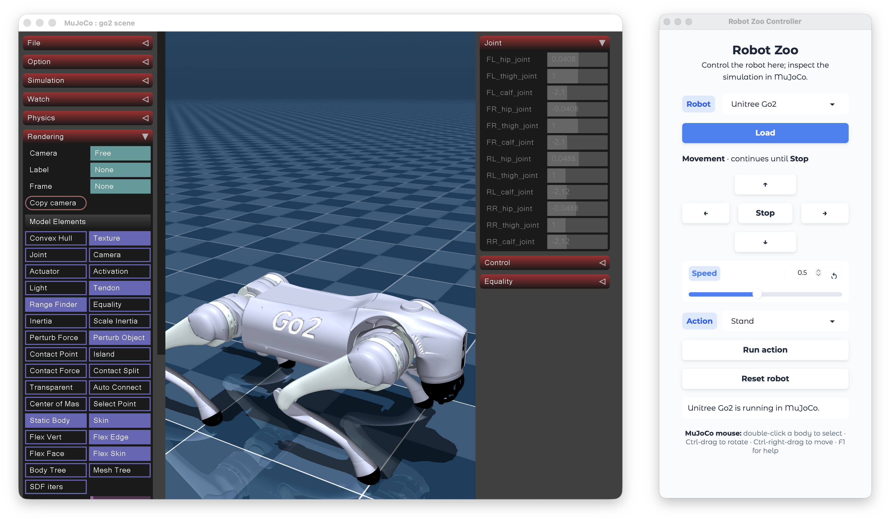
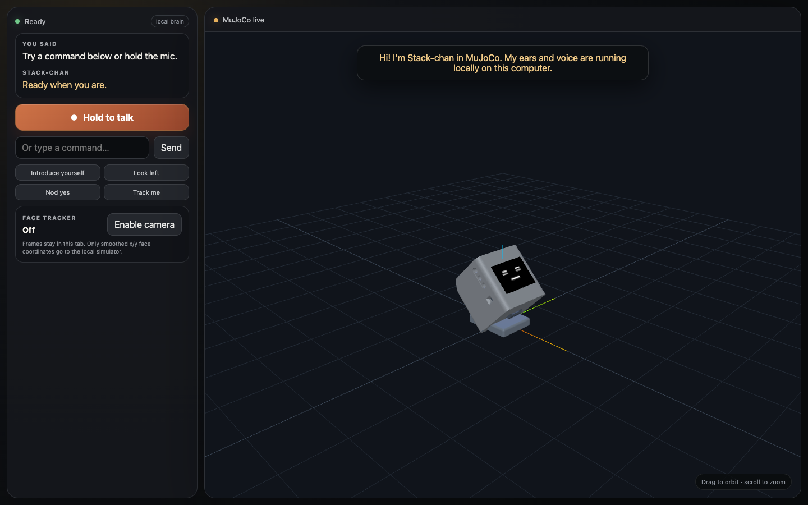

<div align="center">

<picture>
  <source media="(prefers-color-scheme: dark)" srcset="https://raw.githubusercontent.com/robium-ai/robium/main/assets/brand/robium-lockup-dark.png">
  
</picture>

### Runnable robotics reference applications

Explore the code. Get a robot working. Make it yours.

[](https://robium.ai/demos/)
[](https://github.com/robium-ai/robium)
[](LICENSE)

</div>

<table>
  <tr>
    <td width="50%" align="center">
      <a href="robot-zoo/"></a><br>
      <strong>Robot Zoo</strong> — try three robots
    </td>
    <td width="50%" align="center">
      <a href="stackchan-er2-sim/"></a><br>
      <strong>Talking Stack-chan</strong> — local voice and face tracking
    </td>
  </tr>
</table>

## Start here

Install Robium once. It creates editable local checkouts of both the plugin and
this application library, then remembers where they are.

```bash
npx robium-ai setup
npx robium-ai doctor
```

For the quickest first run, try three interactive MuJoCo robots from any
directory. It needs no Docker, GPU, model checkpoint, or API key:

```bash
npx robium-ai app doctor robot-zoo
npx robium-ai app run robot-zoo
```

The first run builds its pinned environment and downloads the three robot
models. You should see MuJoCo's standard viewer on the left and a compact
native controller on the right—no browser window opens.

Prefer to work through your coding agent? Restart it after setup and paste:

> Show me a few robots in MuJoCo that I can try and interact with.

The agent will inspect this repository and the selected app's README, check the
graphical desktop, run the existing example unchanged, and show the working
viewer before proposing custom work.

For an equally local first run with voice and face tracking, try Stack-chan. Its
default brain, Whisper speech recognition, and Kokoro voice all run locally;
Gemini Robotics ER2 remains an explicit opt-in:

```bash
npx robium-ai app doctor stackchan-er2-sim
npx robium-ai app run stackchan-er2-sim
```

Or paste this into your coding agent:

> Show me a simulated Stack-chan I can talk to locally and ask to follow my face.

## Four more guided projects

### Autonomous driving

> Help me run a pretrained vision policy that drives a simulated racetrack in real time on my Mac.

Robium selects [`car-racing-ppo`](car-racing-ppo/). It runs a pinned
third-party PPO checkpoint on CPU in Gymnasium's native CarRacing window; no
training or dedicated GPU is required. The qualified path is Apple Silicon
macOS, and the first build downloads the external model.

```bash
npx robium-ai app doctor car-racing-ppo
npx robium-ai app check car-racing-ppo
npx robium-ai app run car-racing-ppo
```

The runner is MIT licensed, but the external checkpoint declares no license,
so Robium does not bundle or redistribute its weights. This is a toy
visual-control benchmark, not a real-road driving system.

### Robot navigation

> Help me map a simulated environment, localize a mobile robot, and navigate to a goal.

Robium selects [`robot-navigation`](robot-navigation/). Start Docker first;
the visible proof is a simulated robot, map, laser scan, and navigation
controls in the bundled viewer.

```bash
npx robium-ai app doctor robot-navigation
npx robium-ai app run robot-navigation
```

### Pretrained robot-arm manipulation

> Help me run a pretrained policy that transfers a cube between two simulated robot arms.

Robium selects [`act-aloha-cube-transfer`](act-aloha-cube-transfer/). It uses a
pinned official ACT checkpoint, requires no training or dedicated GPU, and has
a tested native path on Apple Silicon. The first run downloads the model. The
visible proof is a live viewer plus an actual inference rollout of the default
cube-transfer scenario.

```bash
npx robium-ai app doctor act-aloha-cube-transfer
npx robium-ai app run act-aloha-cube-transfer
```

### Visual robot assistant

> Help me build a simulated robot assistant that understands what it sees and follows natural-language instructions.

Robium selects [`silly-turtlebot`](silly-turtlebot/), checks Docker, and guides
you through its fast TurtleBot simulation. A live mission needs your own
authorized Gemini Robotics access and may incur API charges. The app also has
hardware-free diagnostics, but those are identified as mock checks rather than
live-model results.

## Application catalog

The first six entries are the best onboarding paths. Other apps may need a
specific host, model access, cloud GPU, or physical robot; each app README is
the source of truth.

| Application | What you can see working | Primary runtime |
| --- | --- | --- |
| [robot-zoo](robot-zoo/) | Switch among and interact with three robots in MuJoCo's native viewer | uv, MuJoCo |
| [stackchan-er2-sim](stackchan-er2-sim/) | Talk locally to Stack-chan and let its MuJoCo head follow your face | uv, MuJoCo + Three.js |
| [car-racing-ppo](car-racing-ppo/) | Watch a pinned pretrained vision policy drive a generated racetrack in real time | uv, Gymnasium |
| [robot-navigation](robot-navigation/) | Map a simulated home, localize, and drive Nav2 goals | Docker |
| [act-aloha-cube-transfer](act-aloha-cube-transfer/) | Run pretrained bimanual cube transfer | uv, MuJoCo |
| [silly-turtlebot](silly-turtlebot/) | Give visual, natural-language missions to a simulated TurtleBot | uv + Docker |
| [diffusion-policy-pusht](diffusion-policy-pusht/) | Replay a published PushT Diffusion Policy | uv, MPS or CPU |
| [vla-pick-and-place](vla-pick-and-place/) | Inspect Pi0.5 in LIBERO; run live inference on a supported GPU | remote NVIDIA GPU |
| [quadruped-locomotion](quadruped-locomotion/) | Drive a trained Unitree Go2 in Isaac Sim | remote NVIDIA GPU |
| [smolvla-mbot-push](smolvla-mbot-push/) | Teleoperate a differential-drive pushing task in MuJoCo | uv |
| [robot-teleoperation](robot-teleoperation/) | Drive a real TurtleBot 4 from a browser | TurtleBot 4 hardware |
| [lego-powered-up-teleop](lego-powered-up-teleop/) | Drive a LEGO robot over Bluetooth | LEGO hardware + uv |
| [mbot-data-collection](mbot-data-collection/) | Record language-conditioned mBot episodes for LeRobot | mBot hardware + uv |
| [stackchan-er2](stackchan-er2/) | Talk to a vision-and-voice companion that controls LEGO | STACK-CHAN + LEGO hardware |

Browse the live metadata from any folder with:

```bash
npx robium-ai app list
npx robium-ai app help robot-navigation
```

## Make your own app

Do not develop personal projects inside this reference checkout. Copy the
closest proven app into the workspace's separate `my-apps/` directory:

```bash
npx robium-ai app new my-robot --from robot-navigation
```

The new app is fully editable while this checkout stays clean and safely
updatable. For contributing a reusable application here, read
[CONTRIBUTING.md](CONTRIBUTING.md) and the
[reference-application standard](docs/reference-applications-design.md).

## License

[MIT](LICENSE)
