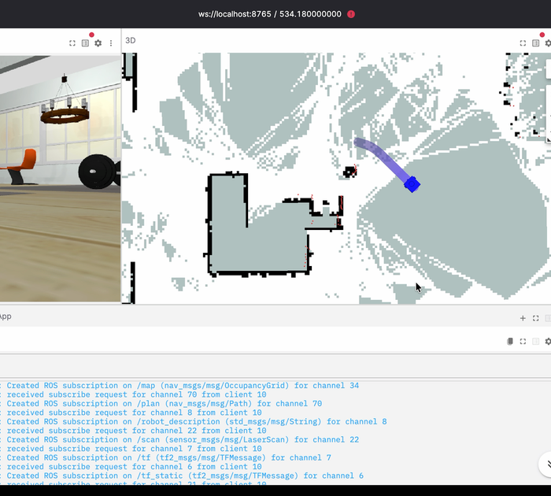

# Robium reference applications

Runnable robotics projects built with the
[Robium skills plugin](https://github.com/robium-ai/robium). Explore the code,
get one working, then copy the closest example and make it yours.

<table>
  <tr>
    <td width="60%">
      <a href="robot-navigation/"></a>
    </td>
    <td width="40%" valign="middle">
      <strong>Your first Robium project</strong><br><br>
      Map a simulated home, localize a TurtleBot, and send it to a Nav2 goal.<br><br>
      <code>Simulation · Docker · No GPU</code>
    </td>
  </tr>
</table>

## Start here

Install Robium once. It creates editable local checkouts of both the plugin and
this application library, then remembers where they are.

```bash
npx robium-ai setup
npx robium-ai doctor
```

For the most reliable first run, start Docker and try the stable navigation
example from any directory:

```bash
npx robium-ai app doctor robot-navigation
npx robium-ai app run robot-navigation
```

The first run may build or download its pinned environment. Follow the URL
printed by the launcher. You should see the simulated robot, map, laser scan,
and navigation controls in the bundled viewer.

Prefer to work through your coding agent? Restart it after setup and paste:

> Help me map a simulated environment, localize a mobile robot, and navigate to a goal.

The agent will inspect this repository and the selected app's README, check
Docker and ports, run the existing example unchanged, and verify a saved map,
localization, and a reached goal before proposing custom work.

## Two more first projects

### Pretrained robot-arm manipulation

> Help me run a pretrained policy that transfers a cube between two simulated robot arms.

Robium selects [`act-aloha-cube-transfer`](act-aloha-cube-transfer/). It uses a
pinned official ACT checkpoint, requires no training or dedicated GPU, and has
a tested native path on Apple Silicon. The first run downloads the model. The
visible proof is a live viewer plus an actual inference rollout of the default
cube-transfer scenario.

```bash
npx robium-ai app doctor act-aloha-cube-transfer
npx robium-ai app run act-aloha-cube-transfer
```

### Visual robot assistant

> Help me build a simulated robot assistant that understands what it sees and follows natural-language instructions.

Robium selects [`silly-turtlebot`](silly-turtlebot/), checks Docker, and guides
you through its fast TurtleBot simulation. A live mission needs your own
authorized Gemini Robotics access and may incur API charges. The app also has
hardware-free diagnostics, but those are identified as mock checks rather than
live-model results.

## Application catalog

The first three entries are the best onboarding paths. Other apps may need a
specific host, model access, cloud GPU, or physical robot; each app README is
the source of truth.

| Application | What you can see working | Primary runtime |
| --- | --- | --- |
| [robot-navigation](robot-navigation/) | Map a simulated home, localize, and drive Nav2 goals | Docker |
| [act-aloha-cube-transfer](act-aloha-cube-transfer/) | Run pretrained bimanual cube transfer | uv, MuJoCo |
| [silly-turtlebot](silly-turtlebot/) | Give visual, natural-language missions to a simulated TurtleBot | uv + Docker |
| [diffusion-policy-pusht](diffusion-policy-pusht/) | Replay a published PushT Diffusion Policy | uv, MPS or CPU |
| [vla-pick-and-place](vla-pick-and-place/) | Inspect Pi0.5 in LIBERO; run live inference on a supported GPU | remote NVIDIA GPU |
| [quadruped-locomotion](quadruped-locomotion/) | Drive a trained Unitree Go2 in Isaac Sim | remote NVIDIA GPU |
| [smolvla-mbot-push](smolvla-mbot-push/) | Teleoperate a differential-drive pushing task in MuJoCo | uv |
| [robot-teleoperation](robot-teleoperation/) | Drive a real TurtleBot 4 from a browser | TurtleBot 4 hardware |
| [lego-powered-up-teleop](lego-powered-up-teleop/) | Drive a LEGO robot over Bluetooth | LEGO hardware + uv |
| [mbot-data-collection](mbot-data-collection/) | Record language-conditioned mBot episodes for LeRobot | mBot hardware + uv |
| [stackchan-er2](stackchan-er2/) | Talk to a vision-and-voice companion that controls LEGO | STACK-CHAN + LEGO hardware |

Browse the live metadata from any folder with:

```bash
npx robium-ai app list
npx robium-ai app help robot-navigation
```

## Make your own app

Do not develop personal projects inside this reference checkout. Copy the
closest proven app into the workspace's separate `my-apps/` directory:

```bash
npx robium-ai app new my-robot --from robot-navigation
```

The new app is fully editable while this checkout stays clean and safely
updatable. For contributing a reusable application here, read
[CONTRIBUTING.md](CONTRIBUTING.md) and the
[reference-application standard](docs/reference-applications-design.md).

## License

[MIT](LICENSE)
