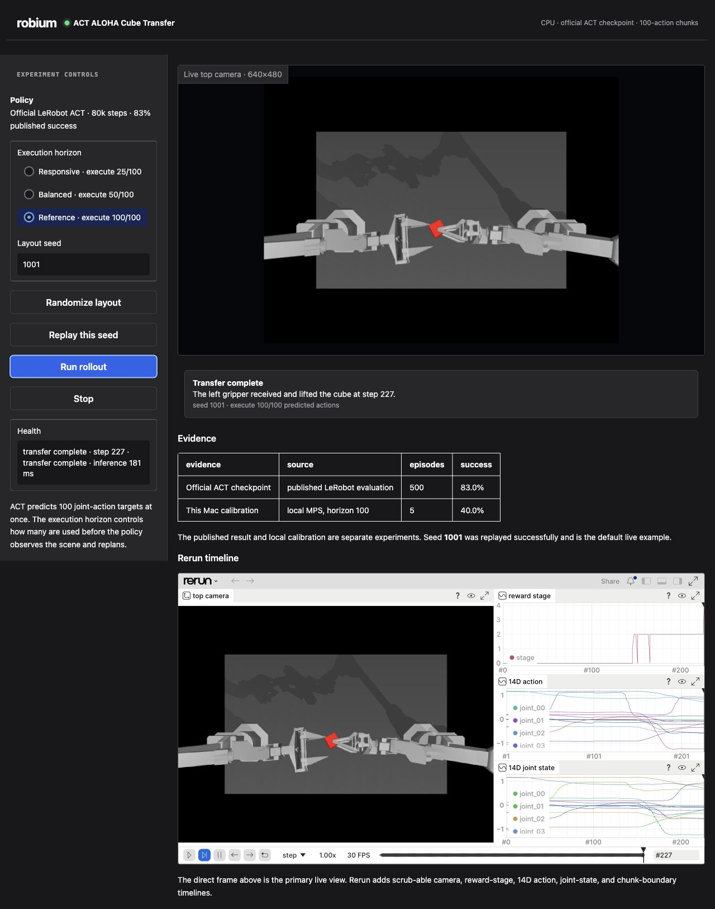

We built this application to give ACT a task that matches its design. The
result runs LeRobot's official ALOHA Transfer Cube checkpoint on a Mac, exposes
the policy's 100-action predictions, and keeps the published benchmark separate
from every local rollout.

There is no training step in the setup. The application downloads one pinned
checkpoint, migrates its legacy normalization data with LeRobot's current
tooling, and runs it in the official MuJoCo environment. Apple Silicon uses
MPS; the website-compatible image uses CPU-only PyTorch.


*This is a real deterministic rollout from the reference app, not a staged
animation. The capture metadata records the pinned revision, seed, horizon,
device, step count, and terminal simulator stage.*



> **Robium skills used:**
> [architect](https://github.com/robium-ai/robium/tree/main/skills/architect)
> helped select a task where ACT was a natural fit;
> [lerobot](https://github.com/robium-ai/robium/tree/main/skills/lerobot)
> guided the checkpoint and rollout contract; and
> [environments](https://github.com/robium-ai/robium/tree/main/skills/environments)
> kept native MPS and the reproducible CPU image as explicit runtime paths.

## Why ACT fits ALOHA Cube Transfer

ALOHA Transfer Cube is a bimanual imitation-learning task. One simulated arm
picks up a cube, moves it toward the center, and presents it to the other arm.
The receiving gripper makes contact and lifts the cube to complete the task.

The observation contains a 480×640 top-camera image and fourteen joint-state
values. Every action also has fourteen values, covering both arms and
grippers. Coordinating them one control command at a time would leave a long
effective horizon.

ACT, Action Chunking with Transformers, predicts a sequence instead. This
checkpoint produces 100 future joint targets from the current observation.
Executing a coherent chunk reduces the number of high-level decisions and
helps preserve smooth behavior learned from demonstrations.

LeRobot publishes a task-matched checkpoint at
`lerobot/act_aloha_sim_transfer_cube_human`. Its attached evaluation reports
83% success over 500 episodes. That made it a stronger reference than training
a new model merely to produce a demo.

## ACT, Diffusion Policy, or SmolVLA?

These policy families overlap, but they are not interchangeable labels.

| Policy | Strong starting point | Main tradeoff |
| --- | --- | --- |
| ACT | Demonstration-driven manipulation with coordinated, smooth action sequences | Chunk and execution horizons must fit the control problem |
| Diffusion Policy | Contact-rich or multimodal behavior with a matching dataset or checkpoint | Every plan needs repeated denoising evaluations |
| SmolVLA | Multiple tasks or objects where language changes the requested behavior | More model capacity, data preparation, and fine-tuning compute |

We chose Diffusion Policy for the PushT reference application because PushT is
an established benchmark for that policy family and a strong published model
already existed. We chose ACT here because ALOHA's original motivation is
fine-grained, coordinated manipulation learned from demonstrations.

SmolVLA belongs in a different application: one where instructions such as
“hand me the red cube” or “place the object in the left bin” are genuine model
inputs. ALOHA Transfer Cube has one fixed objective, so language conditioning
would add complexity without adding information.

The practical decision is to match the policy to the task and available
evidence. A smaller or faster model is not automatically simpler if its data,
observation contract, or objective does not match the behavior you need.

## Run it on macOS

You need Git, [uv](https://docs.astral.sh/uv/), a modern browser, and port 8765.
No NVIDIA GPU or physical robot is required.

Install Robium, clone the applications repository, and start the app:

```bash
npx robium-ai@latest setup
git clone https://github.com/robium-ai/robium-apps.git
cd robium-apps/act-aloha-cube-transfer
./app doctor
./app run
```

Open [http://localhost:8765](http://localhost:8765).

The first run resolves the exact Python 3.12 environment and downloads about
207 MB of checkpoint source plus the ResNet backbone. Later runs reuse the
environment, migrated model, and cache.

The launcher matches the other Robium reference apps:

| Command | Purpose |
| --- | --- |
| `./app doctor` | Check uv, checkpoint, device, Docker, and port readiness |
| `./app build` | Prepare and verify the official checkpoint explicitly |
| `./app run` | Build if needed and start the live workspace |
| `./app status` | Show process, URL, PID, and log path |
| `./app logs` | Follow the application log |
| `./app stop` | Stop the workspace |

## Read an action chunk

The execution-horizon control does not select a different checkpoint. It
changes how many actions from each 100-action prediction are applied before the
policy observes the scene and replans.

- **25/100** replans most often and spends more time in inference.
- **50/100** is a middle ground for experiments.
- **100/100** executes the complete reference chunk.

Keeping the layout seed fixed makes those comparisons meaningful. Seed 1001
is the default because it succeeded in the bounded MPS calibration and then
succeeded again on replay. Randomize creates another deterministic placement
that can be entered again later.

The primary view is a complete inline camera frame, so updates do not depend on
temporary image URLs. Rerun adds a scrub-able record of the same episode:
camera frames, reward stage, policy calls, chunk indices, inference time, and
all fourteen state and action dimensions.

> **Robium skills used:**
> [rerun](https://github.com/robium-ai/robium/tree/main/skills/rerun)
> guided the typed rollout timeline, while
> [testing](https://github.com/robium-ai/robium/tree/main/skills/testing)
> kept the direct frame primary and required actual populated telemetry rather
> than treating an empty viewer element as a pass.

## Migrate the published checkpoint without changing its weights

The official checkpoint predates LeRobot's current standalone preprocessor and
postprocessor files. A current policy loader therefore cannot use the raw Hub
snapshot directly.

LeRobot 0.6.1 includes an official normalization migration. The application
runs that tool into a separate directory, removes the legacy normalization
buffers from the copied state dictionary, and creates current processor files
from those exact statistics. The original revisioned download stays untouched.

The build then checks that every remaining weight matches, verifies the model
and processor artifacts, hashes both source and migrated files, and writes a
manifest. A partially migrated directory is never accepted as ready.

This is an important distinction: compatibility work should preserve the
model's learned contract. Recomputing normalization from another dataset could
produce files with the right names while changing the policy's behavior.

## Keep published and local evidence separate

The workspace shows two rows:

- **Official ACT checkpoint:** 83% over 500 published evaluation episodes.
- **Robium MPS calibration:** two successes across seeds 1000–1004 with the
  100-action execution horizon.

The five local runs are a compatibility and replay check. They are not large
enough to re-estimate an 83% success rate. The app stores failures as well as
successes and never draws a learning curve between unrelated experiments.

The simulator reports five stages: reaching, right-gripper contact, cube
lifted, left-gripper contact, and transfer complete. The UI uses those exact
environment stages. It does not turn contact into a stronger physical claim
about long-term grasp stability.

## Make MuJoCo work behind a browser callback

The most platform-specific failure was not in ACT. On macOS, creating the
gym-aloha environment from a Gradio worker thread raised an AppKit exception:
the GLFW window must be initialized on the main thread.

The app runs previews and episodes in spawned child processes. Each process
creates MuJoCo and GLFW on its own main thread, sends typed rollout events back
to the UI, and closes the environment at the episode boundary. Stop uses a
shared cancellation event and takes effect at the next simulator action.

That design also prevents two browser jobs from mutating one environment.
Rollouts acquire a bounded lock, so a failed or disconnected session cannot
hold the app indefinitely.

## Package the website-compatible CPU path

The native path remains best on Apple Silicon because Docker Desktop cannot
pass MPS into a Linux container. The hosted-compatible image uses CPU-only
PyTorch, MuJoCo EGL rendering, the migrated checkpoint, and a baked torchvision
backbone cache.

The gateway reports ready only after a real CPU prediction returns a finite
100×14 action chunk. Its lifecycle contract provides claim, status, and
shutdown endpoints for a private 30-minute session. A complete container smoke
then verifies foreign-session rejection, the mounted UI, terminal transfer
state, and the absence of any lazy runtime download.

On the tested Docker Desktop runtime, seed 1001 completed through the Gradio
API and its final policy call took 900 ms. That stayed below the two-second
interactive gate, so this reference app does not need a GPU hosting path.

## Verify the complete app

```bash
make smoke
make demo-smoke
make demo-image
make demo-container-smoke
```

The checks cover the launcher, deterministic environment reset, observation
and action shapes, migration provenance, real CPU inference, chunk scheduling,
cancellation, inline frames, evidence labels, readiness inference, session
guards, and a terminal transfer through the production-shaped image.

The implementation is in the
[robium-apps repository](https://github.com/robium-ai/robium-apps/tree/main/act-aloha-cube-transfer).
The architecture brief beside it records the rejected alternatives and the
measured result for each initial risk.
