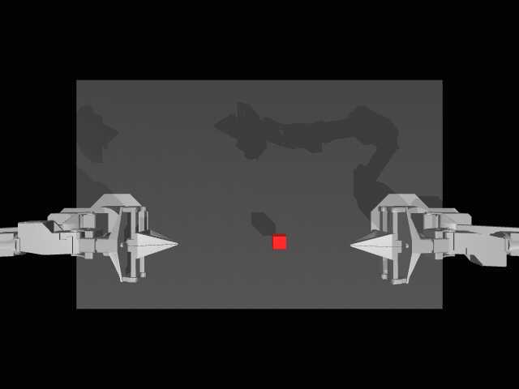
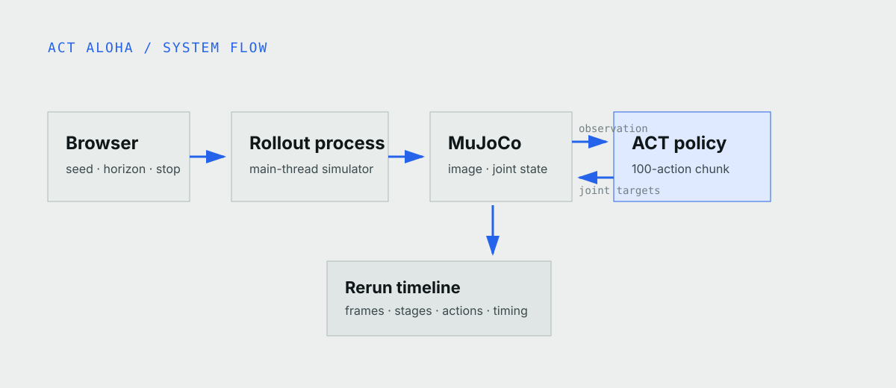

Before ALOHA, a bimanual learning experiment could begin with an awkward
problem: the robot and teleoperation rig were expensive before anyone had
collected a single demonstration.

The original [ALOHA project](https://tonyzhaozh.github.io/aloha/) approached
that problem from both sides. It introduced an open, comparatively low-cost
two-arm teleoperation system for recording human demonstrations, then paired
it with Action Chunking with Transformers, or ACT, to learn from those
demonstrations. The researchers showed fine tasks such as opening a cup and
slotting a battery with about 50 demonstrations per task.

That combination mattered more than either piece alone. ALOHA made it practical
to collect coordinated two-arm data; ACT turned that data into a policy. The
hardware, code, datasets, and simulation tasks were released openly, which is
why ALOHA became such a recognizable starting point for imitation-learning
experiments.

This tutorial removes the physical hardware and keeps the learning loop. Two
simulated ALOHA arms pass a red cube from one gripper to the other while the
official ACT policy chooses the joint targets.



*A real ACT rollout in MuJoCo. The right arm lifts the cube and the left arm
completes the transfer.*

## Why ACT predicts a chunk instead of one action

A long manipulation task is difficult to learn one command at a time. Small
errors accumulate, and two arms can drift out of sync. ACT shortens that
effective horizon by predicting a sequence of future actions in one pass.

The checkpoint used here observes a 480 by 640 top-camera image and fourteen
joint values. It predicts 100 future fourteen-dimensional joint targets for
the two arms and grippers. The app can execute the full chunk or replan after
25 or 50 actions so you can see the tradeoff between coherent motion and fresh
feedback.

ACT is still one of the easiest learned manipulation policies to start with.
It is smaller and quicker to run than a VLA, its objective is fixed and easy to
evaluate, and LeRobot recommends it as a first imitation-learning model.

## The simulator is MuJoCo, wrapped by gym-aloha

This is not a video of the physical ALOHA hardware. The application runs
[`gym-aloha`](https://github.com/huggingface/gym-aloha), which defines the
Transfer Cube task, observation and action spaces, and success stages.
[MuJoCo](https://mujoco.org/) supplies the robot dynamics, contacts, cameras,
and rendering underneath it.

The right arm must grasp and lift the cube; the left arm must receive it. The
simulator reports the progress from first contact through a completed transfer.
The browser lets you switch between manual joint control and the pretrained ACT
policy, randomize the cube layout, and inspect the rollout timeline in Rerun.



*The camera and joint state go into ACT. MuJoCo executes part of the predicted
action chunk, then the policy observes again.*

## Run it locally without an NVIDIA GPU

The published policy runs locally on Apple Silicon with MPS and can fall back
to CPU. You do not need a physical ALOHA robot, an NVIDIA GPU, or a training
run for this tutorial.

```bash
npx robium-ai@latest setup
git clone https://github.com/robium-ai/robium-apps.git
cd robium-apps/act-aloha-cube-transfer
./app doctor
./app run
```

Open [http://localhost:8765](http://localhost:8765). The first run prepares the
Python environment and downloads about 207 MB of model weights. Later starts
reuse both. Run `./app stop` when you are finished.

You can also open the [live ACT demo](/demos/act-aloha-cube-transfer/live) for
a temporary browser session, or use the [demo page](/demos/act-aloha-cube-transfer)
to see the recorded result before starting anything.

## What this checkpoint shows

The app uses LeRobot's official 80k-step
[`act_aloha_sim_transfer_cube_human`](https://huggingface.co/lerobot/act_aloha_sim_transfer_cube_human)
checkpoint. It comes from an older LeRobot release, so the launcher prepares a
compatible local copy without changing the pinned source weights.

Its model card reports 83 percent success over 500 simulated episodes. Our
local calibration is deliberately smaller: two of five Apple MPS runs
completed, and seed 1001 completed again when replayed. Those local runs prove
that the checkpoint, simulator, and application work together; they are not a
new estimate of the policy's success rate.

> [!EVIDENCE]
> Seed 1001 reached the simulator's final transfer stage with the full
> 100-action execution horizon. The application records the checkpoint,
> device, seed, action horizon, and simulator result for that episode.

## From replaying a policy to training your own

The quick start performs inference only, and its manual controls are for
exploring the simulator rather than recording a training dataset. You do not
have to stop at the older checkpoint, though.

The current [LeRobot imitation-learning
workflow](https://huggingface.co/docs/lerobot/il_robots) is to teleoperate a
supported robot, record a set of demonstrations, train a fresh ACT policy, and
evaluate the resulting checkpoint. Start with a short smoke-training run to
verify the dataset and policy shapes before spending hours on a full run.

Apple Silicon is enough for inference and small experiments. It can train ACT,
but a CUDA GPU is the practical choice for larger image datasets or repeated
training runs. The important first step is not maximum scale; it is proving
that recording, training, and evaluation form one reproducible loop.

## Where to go next

[Mobile ALOHA](https://mobile-aloha.github.io/) carried ACT into longer,
whole-body household tasks, while [ALOHA 2](https://aloha-2.github.io/)
improved the hardware for larger-scale demonstration collection.

For another lightweight policy experiment, continue with [Diffusion Policy on
PushT](/blog/diffusion-policy-pusht). When language must change the requested
object or action, the [Pi0.5 VLA tutorial](/blog/vla-pick-and-place) shows the
larger next step.

## The Robium skills behind the tutorial

[lerobot](https://github.com/robium-ai/robium/tree/main/skills/lerobot) guided
the ACT policy, demonstration workflow, and separation between training and
inference. [environments](https://github.com/robium-ai/robium/tree/main/skills/environments)
kept the local MPS and CPU paths reproducible, while
[testing](https://github.com/robium-ai/robium/tree/main/skills/testing) kept
the published 500-episode result separate from the smaller local replay.

The useful lesson is simple: begin with a task you can observe and measure,
verify one complete learned-policy rollout, then collect data and train your
own checkpoint when you are ready to change the behavior.

Source, tests, and architecture notes live in the
[ACT ALOHA application repository](https://github.com/robium-ai/robium-apps/tree/main/act-aloha-cube-transfer).
If something does not work, ask in the [Robium Discord](https://robium.ai/join/discord)
or [create an issue](https://github.com/robium-ai/robium-apps/issues/new) with
your operating system and the output from `./app doctor`.
