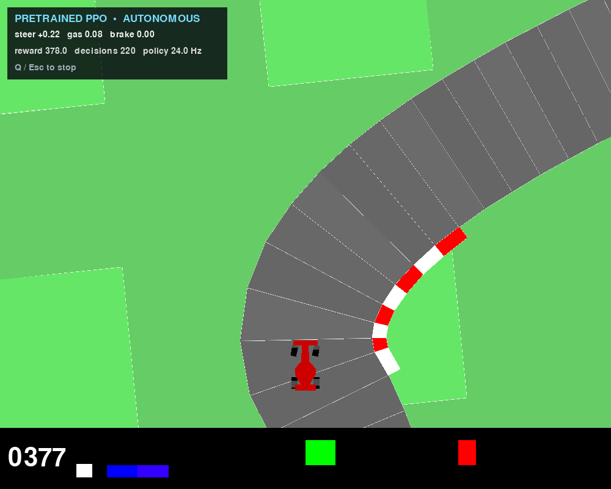

# CarRacing PPO

Watch a pinned PPO policy drive Gymnasium's procedurally generated CarRacing
track on an Apple Silicon Mac. Camera pixels go in; continuous steering, gas,
and brake commands come out. No training or dedicated GPU is required.



*A live simulated seed-1 run on an Apple M5. The overlay reports the policy's
current controls, reward, decision count, and inference rate.*

> **Third-party checkpoint:** the app code is MIT licensed, but the upstream
> `pableitorr/ppo-CarRacing-v2` repository declares no checkpoint license.
> Robium does not bundle or redistribute the weights; the first build downloads
> the pinned external file for local evaluation.

This is a toy visual-control benchmark, not a real-road autonomous-driving
system. It has no traffic understanding, route planning, language reasoning,
or vehicle interface.

## Quick start

Install [uv](https://docs.astral.sh/uv/), then run from this directory:

```bash
./app doctor
./app build
./app run
```

With Robium installed, the same path works from any directory:

```bash
npx robium-ai app doctor car-racing-ppo
npx robium-ai app check car-racing-ppo
npx robium-ai app run car-racing-ppo
```

The first build installs the locked Python environment and downloads a 10.5 MB
checkpoint. Later runs reuse both caches. In the simulation window, press `Q`
or `Esc` to stop; closing the window also ends the run.

The overlay shows steering, gas, brake, accumulated reward, and policy rate.
Gymnasium's own dashboard remains visible at the bottom.

## Commands

| Command | Purpose |
| --- | --- |
| `./app doctor` | Check uv, platform, environment, and checkpoint readiness |
| `./app build` | Prepare the locked environment and fetch the pinned checkpoint |
| `./app run` | Open the verified seed-1 autonomous rollout |
| `./app run --seed 7` | Try another reproducible generated track |
| `./app check` | Run three headless seeded episodes and save measured evidence |
| `./app smoke` | Run local tests and one real checkpoint episode |

Headless evidence is written to `outputs/last-check.json`. It reports wall
time, simulated FPS, episode reward, termination state, and the exact model
revision and checksum. The output is intentionally ignored by Git.

The default visible run uses seed 1 because the locally verified policy
completed that track. Other seeds intentionally remain available to show both
the policy's generalization and its failures.

## Reproducibility

The external model and its original preprocessing are pinned:

- Hugging Face repository: `pableitorr/ppo-CarRacing-v2`
- Revision: `a3d30ae5f460c866df89364e14ceee7e9f5949ce`
- Checkpoint SHA-256: `edb9a2d98c51172c3723d2b1cc2a752a4c3832f14a3d2b1200297f4d4ea763ca`
- Stable-Baselines3: 2.3.2
- Gymnasium: 0.29.1 (`CarRacing-v2`)
- Python: 3.10
- Preprocessing: frame skip 2, 64×64 grayscale, two stacked frames

Only Apple Silicon macOS is qualified. Linux and Intel macOS may work, but the
reference app does not claim them without a real-platform check.

## Measured evidence

The upstream card reports `796.66 ± 125.12` reward over ten deterministic
episodes, but marks that result as unverified. This app records its own local
results instead of repeating that number as fact.

On an Apple M5 CPU check on 2026-09-24, seeds 0–2 averaged 628.53 reward and
315.4 simulated FPS headless. Seed 1 completed all 275 track tiles in 876
simulated frames with 912.50 reward; seeds 0 and 2 reached 74.9% and 42.4%
before the time limit. The native visible seed-1 loop measured about 47–48 FPS
against Gymnasium's 50 FPS render target.

See [the architecture brief](docs/architecture-brief.md) for the system boundary,
publishing constraints, and deferred work.
