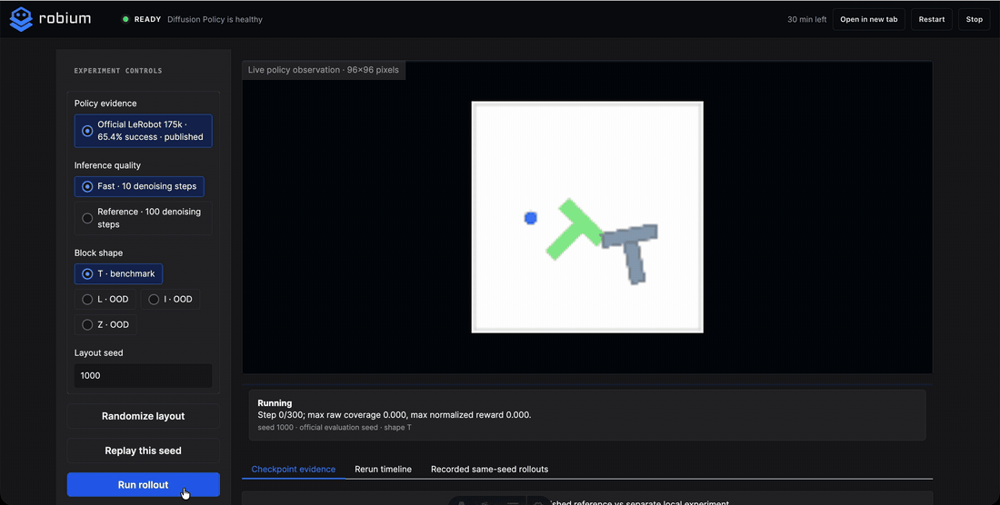
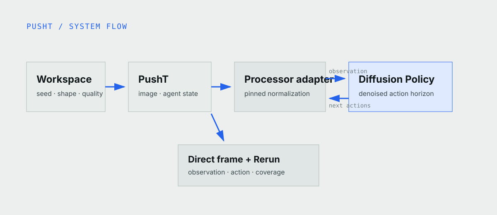
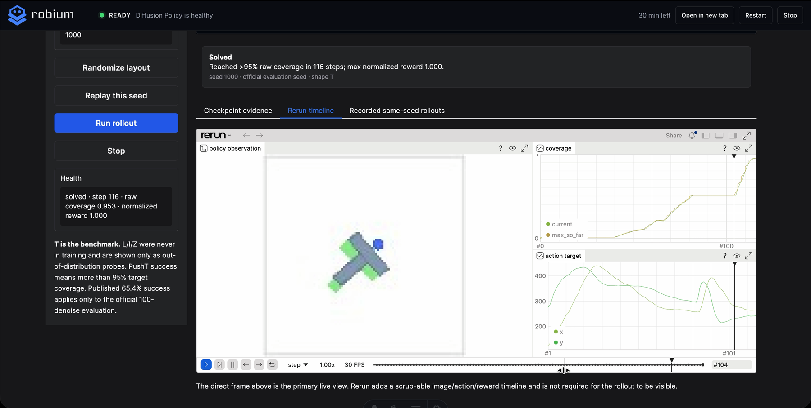

Robot learning is easier to understand when the first experiment is small.
PushT has one agent, one block, one camera view, and one clear objective: push
the gray T into the green target. It runs on a laptop and finishes quickly
enough to watch.

Small does not mean scripted. A trained policy reads the image and agent
position, predicts actions, sees what happened, and tries again. This tutorial
runs that complete loop with LeRobot's published Diffusion Policy checkpoint.
You do not need a physical robot, an NVIDIA GPU, or a new training run.



*A real policy rollout in the browser workspace. The current observation stays
visible while the policy replans and Rerun records the trajectory.*

## Why PushT is a useful first experiment

[PushT](https://huggingface.co/datasets/lerobot/pusht) gives the policy a 96 by
96 RGB image and the agent's 2D position. The policy predicts a short action
sequence, the simulator executes part of it, and the policy observes again. An
episode succeeds when the T covers more than 95 percent of the target.

The agent still has to find a useful contact point, rotate and translate the
block without a gripper, and recover after losing contact. You can inspect each
part of that loop instead of accepting a success video on faith. Verify that
the data, policy, environment, and evaluation agree here; then add complexity.

## ACT, Diffusion Policy, or a VLA?

[ACT](https://tonyzhaozh.github.io/aloha/) predicts a chunk of future actions
directly. It is a practical first baseline for a fixed task and is light enough
for local experiments. If you are completely new to learned policies, start
with our [ACT cube-transfer tutorial](/blog/act-aloha-cube-transfer).

[Diffusion Policy](https://diffusion-policy.cs.columbia.edu/) begins with a
noisy action sequence and refines it over several steps. That takes more
inference work, but it is a natural fit when contact is delicate and several
different trajectories could succeed. PushT was used to evaluate the method,
and a task-matched checkpoint is available, so it is the right policy for this
experiment.

A **VLA** adds language to the observation. That becomes useful when an
instruction can change the object, action, or destination. PushT always asks
for the same geometric outcome, so a VLA would add model size without making
the task clearer. When language is actually part of the job, continue with the
[Pi0.5 pick-and-place tutorial](/blog/vla-pick-and-place).

## What the workspace lets you test



*The policy turns the current image and agent state into an action sequence.
The simulator executes a short horizon, then the policy observes again.*

**Fast** uses 10 denoising steps for responsive exploration. **Reference**
uses 100 steps, matching the published evaluation schedule. Keep the seed fixed
to compare them on the same layout. The T is the benchmark; the optional L, I,
and Z blocks show what happens outside the policy's training geometry.

## Run it locally

Install [uv](https://docs.astral.sh/uv/) and ffmpeg, then run:

```bash
npx robium-ai@latest setup
git clone https://github.com/robium-ai/robium-apps.git
cd robium-apps/diffusion-policy-pusht
./app doctor
./app run
```

Open [http://localhost:8765](http://localhost:8765). The first run downloads
roughly 1 GB for the pinned model. Later runs reuse the local environment and
checkpoint, and PyTorch uses MPS on Apple Silicon. Run `./app stop` when you
are finished.

## What has been verified

LeRobot's model card reports 65.4 percent success and 0.955 average maximum
normalized reward over 500 episodes. The application also passes a real local
smoke test: it loads the policy, uses the upstream PushT environment, completes
a seeded rollout, and records the observation, action, and coverage timeline.
It is a learned policy in a running simulator, not a prerecorded animation or
a hand-written controller.



*The final frame and Rerun timeline come from the same completed episode.*

> [!EVIDENCE]
> One local rollout verifies the application path. The published 500-episode
> evaluation remains the stronger measure of policy performance.

## Try it, then build on it

The [demo page](/demos/diffusion-policy-pusht) shows the recorded rollout and
current hosted availability. For hands-on experiments, the local application
is the recommended path.

Once the loop makes sense, change the seed, inference setting, or block shape.
Then try ACT for a different policy architecture, or Pi0.5 when you are ready
to add language and a larger model.

The [lerobot](https://github.com/robium-ai/robium/tree/main/skills/lerobot),
[environments](https://github.com/robium-ai/robium/tree/main/skills/environments),
and [testing](https://github.com/robium-ai/robium/tree/main/skills/testing)
skills guided the policy, local setup, and evidence checks.

Source, commands, tests, and architecture notes live in the
[PushT application repository](https://github.com/robium-ai/robium-apps/tree/main/diffusion-policy-pusht).
If something does not work, ask in the [Robium Discord](https://robium.ai/join/discord)
or [create an issue](https://github.com/robium-ai/robium-apps/issues/new) with
your operating system and the output from `./app doctor`.
