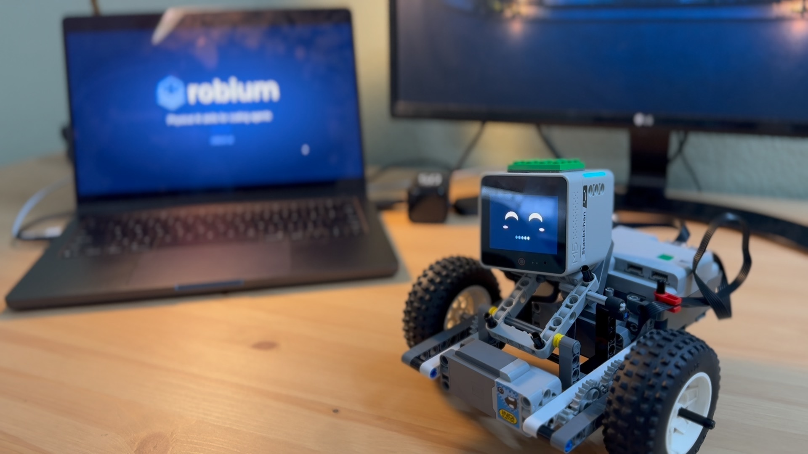
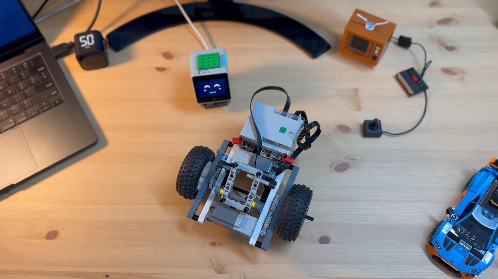
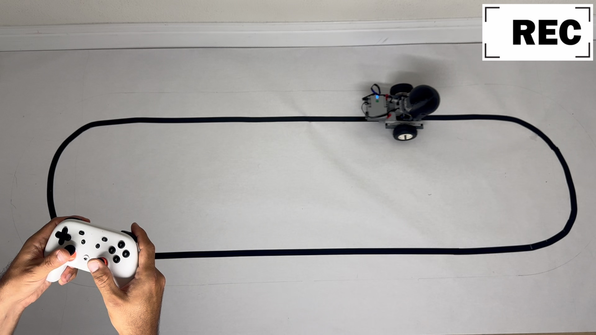
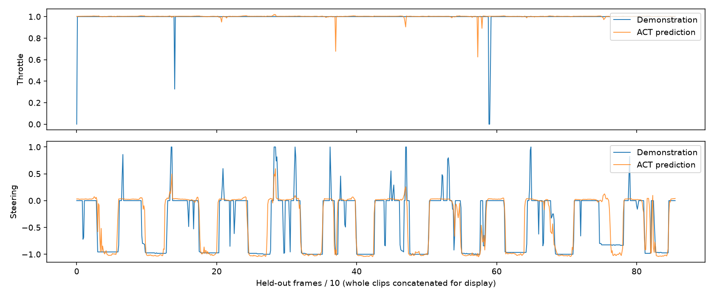
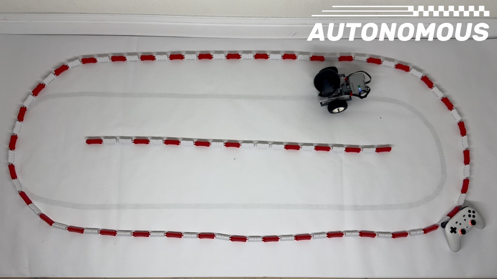
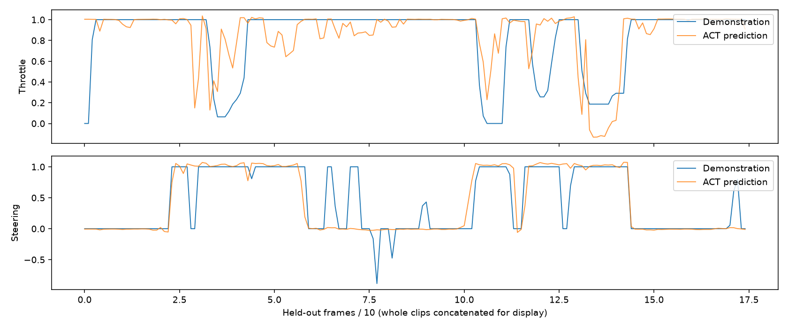

Stack Chan wanted to drive. We put its camera and expressive head on a LEGO
Technic car, drew a track, and taught it from a handful of human-driven runs.
The result is a small, physical imitation-learning project: the robot sees the
route through its own camera, while a policy predicts steering and speed. The
film shows the build, the mistakes, and the supervised track trials.

*The real Stack Chan and LEGO car used in the filmed driving trials.*

  <iframe title="Stack Chan learns to drive with Robium" src="https://www.youtube-nocookie.com/embed/_1pQTt8gqZM" style="width:100%;height:100%;border:0" loading="lazy" referrerpolicy="strict-origin-when-cross-origin" allow="accelerometer; autoplay; clipboard-write; encrypted-media; gyroscope; picture-in-picture; web-share" allowfullscreen></iframe>

[Watch on YouTube](https://www.youtube.com/watch?v=_1pQTt8gqZM) if the player
does not load.

## One robot, three jobs

*The camera head, Pybricks hub, motors, and LEGO wheelbase before the final
mounting. This is a build photograph, not a driving result.*

The M5Stack Stack Chan K151 supplies 320×240 camera frames over Wi-Fi, plus
its face, head movement, and speaker. A LEGO hub running
[Pybricks](https://pybricks.com/) drives two motors on ports D and B. A Mac
receives the camera stream, reads a gamepad, and sends bounded motor commands
over Bluetooth LE. The Mac also saves each image with the joystick action that
was current when the image was captured.

The learned controller runs on the Mac, not on Stack Chan's microcontroller.
It uses [LeRobot](https://github.com/huggingface/lerobot)'s Action Chunking
Transformer (ACT) to predict throttle and steering from each camera image.
Although ACT predicts a short action chunk, the driver applies only its first
action and observes a fresh frame before asking again. A one-second watchdog
in the hub brakes the motors if commands stop arriving.

## From demonstrations to a driving policy

1. **Build and check the hardware.** Install the app's locked Python runtime,
   load the documented Pybricks hub program, and configure Stack Chan's camera
   firmware and Wi-Fi. `./app probe` checks the camera and stopped hub with zero
   motor power before a driving session.
2. **Drive and record.** Open `./app run`, steer the car with a controller or
   keyboard, and hold a recording trigger for each demonstration. The capture
   pairs camera images with throttle and steering samples. We rejected
   unsuccessful clips and kept whole runs together when splitting the data.
3. **Prepare and train.** `./app training prepare` exports the accepted runs as
   LeRobot datasets. We used private Hugging Face dataset repositories and an
   L4 GPU job: a 200-step smoke run first, then full ACT training with
   validation every 1,000 steps. `./app training fetch --stage train` brought
   the selected weights back to the Mac for offline evaluation.
4. **Try it on the track.** `./app run --policy` loads the local checkpoint.
   Hold R1 or Space for policy control; release it or move a driving stick to
   take over. Each hold is limited to 20 seconds. The operator remains beside
   the robot during the trial.

*Human demonstration on the black-tape course. Camera frames were paired with
the operator's throttle and steering commands; video alone was not the training
set.*

The [app README](https://github.com/robium-ai/robium-apps/tree/main/lego-stackchan-drive)
has the firmware, Wi-Fi, safety, capture, and training commands. The datasets
and checkpoints from this experiment are private, so reproducing the training
run requires collecting your own demonstrations and using your own Hugging Face
account.

## What the runs told us

Our first dataset contained **4,079 image/action pairs** from 16 saved clips.
Thirteen clips trained the policy; three complete clips, or 856 frames, were
held out. The L4 job selected its 5,000-step checkpoint and stopped at 10,000
steps when validation stopped improving. On those held-out frames, steering
mean absolute error was **0.1519** in normalized joystick units, compared with
**0.4893** for a constant-action baseline. Shuffling the images raised the
policy's steering error to **0.5410**, evidence that it used the visual input.

*Recorded offline evaluation of the first road-v1 checkpoint on three held-out
clips. Blue is the human action; orange is the model prediction. Agreement
here does not measure whether the car completes a physical lap.*

## The camera and direction lessons

Our first camera framing looked too far toward the horizon. It did not keep the
black line in view around the whole loop, so the policy sometimes had no route
to follow. We aimed the camera roughly **45° down toward the floor** and
collected fresh demonstrations with the line visible more consistently. The
15-second excerpt below is Stack Chan's camera view from about one minute into
a screen recording of a joystick demonstration. It shows the black line moving
through the camera frame; it is not a policy-driven lap.

<video controls playsinline preload="metadata" poster="../assets/stills/stackchan-pov-poster.jpg" style="display:block;width:100%;aspect-ratio:4/3;background:#111" aria-label="Fifteen seconds of Stack Chan's camera view during black-tape demonstration capture">
  <source src="../assets/video/stackchan-pov-demonstration.mp4" type="video/mp4">
  Your browser does not support this video.
</video>

*Real camera footage, cropped from 1:00 to 1:15 of the September 27 screen
recording during human-controlled data collection.*

Direction mattered too. A first set driven only clockwise gave better
track-side results in that direction. When we mixed in counterclockwise runs,
performance dipped for a while. More demonstrations in **both** directions
improved the observed line following. These are observations from the filmed
development process, not a controlled success-rate comparison. The later
20° black-tape model comparison used its own recorded camera setting and
held-out clips, so its errors cannot isolate the effect of direction or the
45° reframing.

Two fresh black-tape models trained from later recordings scored **0.3176**
and **0.3156** mean action error on the same 943 held-out frames. Those figures
are from a different dataset and cannot be compared directly with the first
run's steering-only number. The team observed successful supervised laps, but
the saved records do not identify which later checkpoint produced each filmed
lap. The video is a demonstration on the shown track, not a measured success
rate or a claim about new tracks and lighting.

## The guardrail course

The next challenge replaced the black line with a route bounded by low red and
white LEGO guardrails. After its first collection of demonstrations, Stack Chan
followed this course with few visible problems in our supervised trial. That
was encouraging, but it remains a trial on this specific course rather than a
general result for unseen layouts.

*Filmed policy-driving trial on the red-and-white guardrail course. The image
shows a moment in the run, not a measured lap success rate.*

The separate guardrail ACT run trained on **2,404 frames from two source clips**.
On its one held-out clip of **175 frames**, steering error was **0.1232** in
normalized joystick units. The plot shows where its actions matched and missed
the recorded demonstrator. One short held-out clip is not enough to quantify
physical reliability, and these numbers are not comparable with the black-tape
experiments.

*Recorded offline evaluation of the guardrail model on its single held-out
source clip. Blue is the human action; orange is the model prediction.*

The full [training record](https://github.com/robium-ai/robium-apps/blob/main/lego-stackchan-drive/docs/training-results.md)
includes the dataset splits, model checks, plots, and limits for these runs.

## Keep building with Stack Chan

Robium also has a [Stack Chan ER2 companion](https://github.com/robium-ai/robium-apps/tree/main/stackchan-er2)
that uses voice, vision, and guarded robot actions, and a
[browser-backed Stack Chan simulator](https://github.com/robium-ai/robium-apps/tree/main/stackchan-er2-sim)
for trying its face and voice loop without hardware. The
[LEGO Powered Up teleoperation app](https://github.com/robium-ai/robium-apps/tree/main/lego-powered-up-teleop)
is a smaller starting point for the Pybricks motor path. The driving app joins
those pieces with data collection and a learned policy, and keeps its source and
setup notes in the [Robium applications library](https://github.com/robium-ai/robium-apps/tree/main/lego-stackchan-drive).
