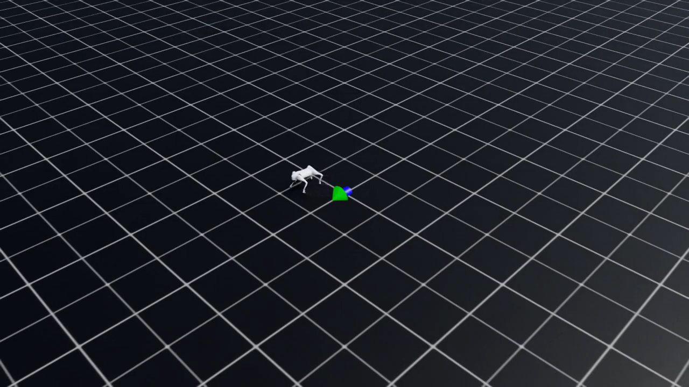
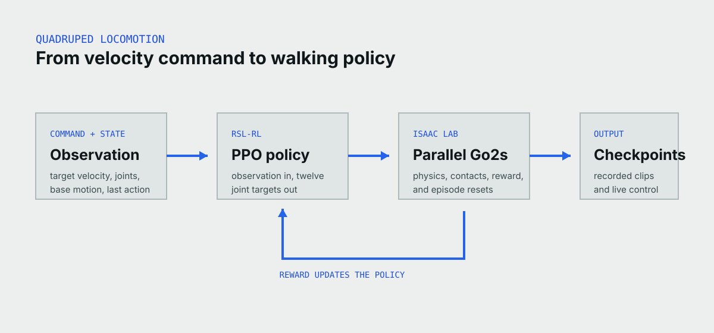

At checkpoint zero, the simulated Go2 mostly fights its own joints. A few
hundred training iterations later, it stays upright and follows a forward
velocity command. The useful part of this application is seeing that change,
not only watching the final gait.



*A frame from the final recorded checkpoint of the recovered 2026-07-27 Isaac
Lab run. The robot and scene are simulated.*

## The policy starts with no example gait

This is reinforcement learning, not imitation learning. The actor network
starts with random weights. It receives the robot state and target velocity,
then produces twelve joint targets. Isaac Lab advances the physics simulation,
scores what happened, and RSL-RL's PPO implementation updates the policy.

No walking demonstration tells the legs which sequence to use. The task and
reward describe the outcome, while the gait emerges through repeated simulated
experience.

We used Isaac Lab's existing flat-terrain Unitree Go2 velocity task because it
keeps the experiment centered on the learning loop. A custom robot model,
terrain generator, or reward rewrite would make the first result harder to
interpret without making the demo more useful.

## Thousands of robots share one update



*Isaac Lab runs many copies of the same task. Their observations, actions, and
rewards feed one PPO policy; saved checkpoints become the recorded and live
experiences.*

GPU parallelism is the reason this workflow is practical. Each simulated Go2
collects experience from a different state. PPO combines that batch into one
policy update, then the next simulation step uses the changed policy.

The wrapper in this repository does not reimplement the environment or RL
library. It chooses a registered task, builds the current Isaac Lab `train` and
`play` commands, and keeps smoke, full training, playback, and evidence
collection behind a few reviewable entry points.

## Try the free part first

The recorded checkpoint explorer works without a GPU. The local checks validate
the command builders and artifact tooling without pretending Isaac Lab runs on
macOS.

```bash
git clone https://github.com/robium-ai/robium-apps.git
cd robium-apps/quadruped-locomotion
make sync
make test
```

On a compatible GPU host with Isaac Lab installed, `make doctor`, `make
list-envs`, and `make smoke` form the paid-compute preflight. The smoke is
mechanical: a brief training run must exit cleanly and create a new checkpoint.
It does not claim that a tiny run learned to walk.

## What survived from the original run

The recovered archive contains 21 checkpoints, TorchScript and ONNX exports,
environment and agent configuration, the full training log, and 15 rollout
clips. The archive SHA-256 is
`de11ce9711a400de005dddff4c6500a8d81e8ae9149016ca159abe563439477f`.

That run used 4,096 parallel environments for 2,000 iterations. Training took
1,937.53 seconds. At the final iteration, the log reported a mean reward of
34.97, a mean episode length of 1,000 steps, and velocity errors of 0.0946 in
the horizontal plane and 0.1612 in yaw. Those are training-loop measurements,
not an independent evaluation set.

Five byte-matched rollout clips form the browser progression: iterations 0,
100, 300, 1,000, and 1,999. The complete manifest records a digest and role for
every file, so a future Hub upload can be checked against the recovered source.

## The first live demo used a simple stream

The original interactive panel did not use WebRTC. It captured Isaac Lab's
rendered frames, served them as one MJPEG stream, and accepted forward, strafe,
and yaw commands from sliders or the keyboard. A checkpoint selector reloaded
weights inside the running process.

That approach reached roughly 13 frames per second through the RunPod HTTP
proxy. Per-frame polling was much slower because each image paid the proxy
round-trip overhead. The new hosted path starts from that known behavior. A
different stream is worth using only if a small real-host probe makes the demo
simpler or more reliable.

## Robium changed the boundary, not the gait

The architecture guidance kept the user-visible outcome small: learn to walk,
show the checkpoint progression, and preserve what happened. The testing
guidance separated a checkpoint-producing smoke from policy-quality evaluation.
The environment and RunPod guidance kept GPU allocation outside the free local
loop and made cleanup an explicit part of a hosted session.

The most important correction was editorial. Versions, GPU models, run sizes,
thresholds, and streaming choices are implementation details until the real
host makes them decisions. The brief now records the outcome and next probe
without turning current recommendations into a contract.

## What remains open

The recovered archive is a real result, but it predates the current application
wrapper. On 2026-08-28, a fresh paid-host smoke loaded checkpoint 1,999, served
changing frames, accepted movement and reset commands, switched to checkpoint
1,900 and back, enforced the capability path, and deleted the temporary Pod.
A fresh training run, independent walking-and-turning evaluation, and immutable
Hugging Face publication remain useful follow-up work rather than publication
blockers for the recorded application.

The task is flat-terrain simulation. It does not establish rough-terrain
performance, transfer to a physical Go2, or safety around people. Public paid
capacity remains disabled until its operating budget and deployment are enabled
separately.
