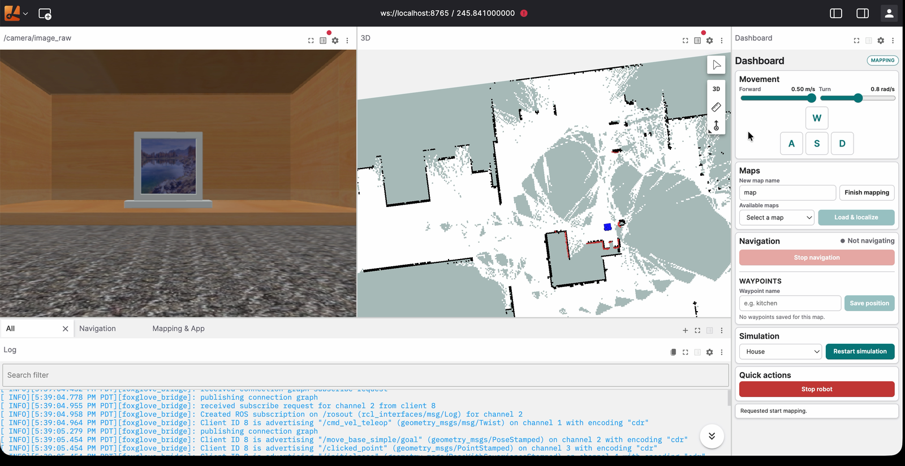
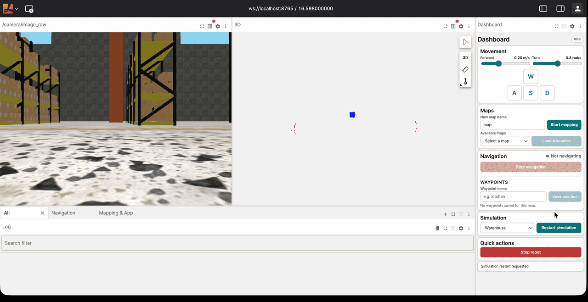
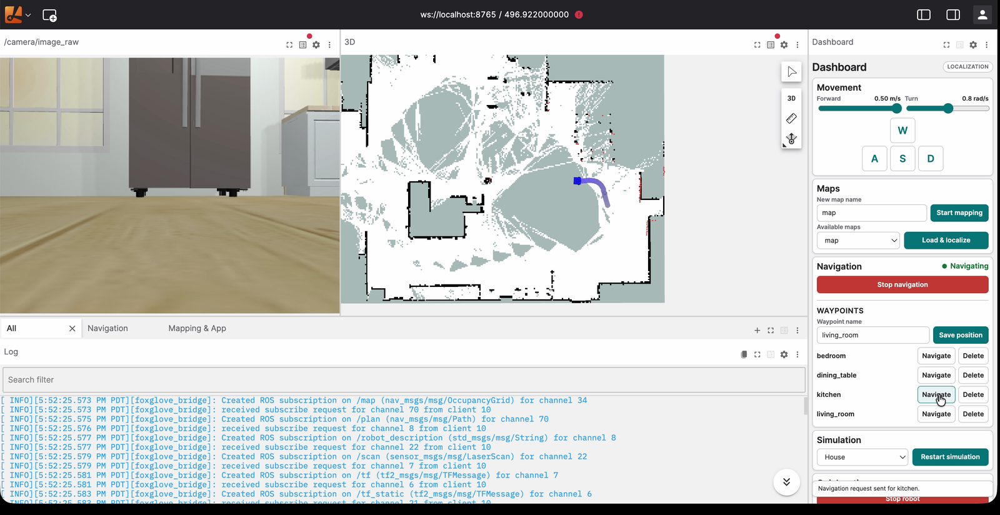
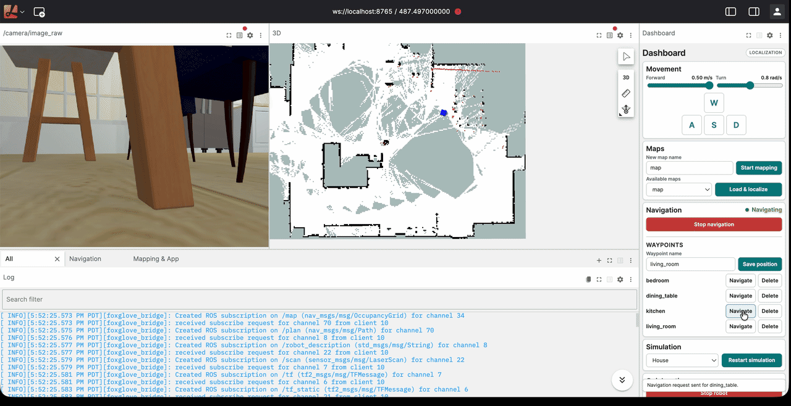
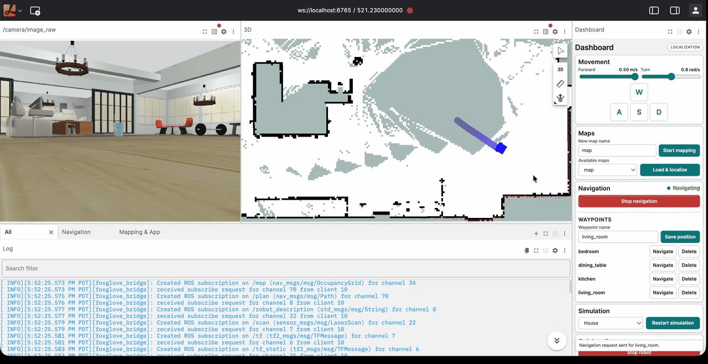
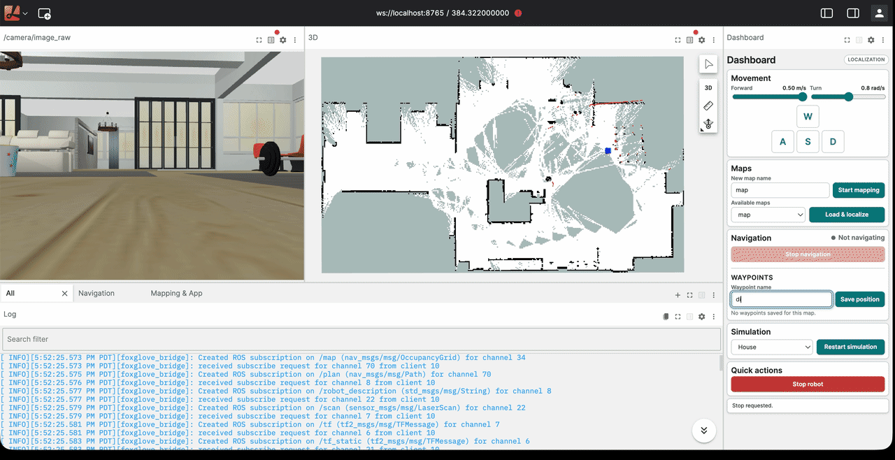
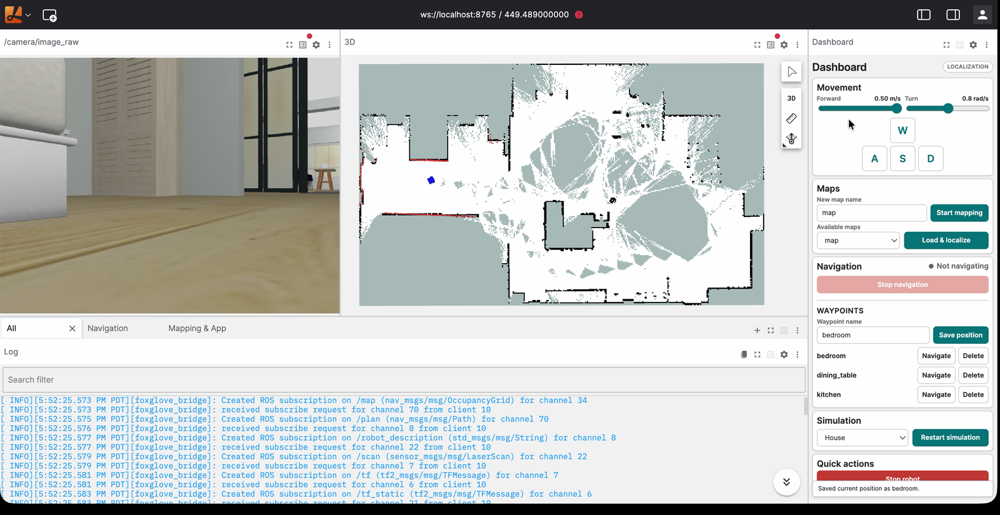

We built this navigation application with [Robium](https://robium.ai/). Its
skills helped us choose the stack, structure the environment, connect ROS 2,
Nav2, Gazebo, and Lichtblick, and debug problems at the boundaries between
them. This tutorial explains the navigation workflow while showing how Robium
helped turn those separate tools into a repeatable application.

**Robot Navigation** is also a living Robium reference application. We continue
to fix bugs and improve the workflow as the underlying robotics tools evolve.

Development was also a feedback loop. We captured the approaches that worked,
the failures we encountered, and the fixes we verified, then fed those lessons
back into Robium. Future applications can begin with guidance grounded in this
working reference instead of starting from scratch.

A common first step in robotics is getting a mobile robot moving through an
environment. That sounds simple, but even a basic navigation application needs
sensors, mapping, localization, planning, control, visualization, and
communication between several robot modules.

[ROS 2](https://docs.ros.org/en/jazzy/) has long provided the backbone for
connecting these systems. Robotics is now expanding toward Physical AI,
vision-language-action models, and higher-level reasoning, but the underlying
plumbing has not disappeared. ROS remains a practical way to get a robot stack
working while you focus on your area of interest. You might build learned arm
control, reason over camera images, or develop task-level autonomy while ROS
handles lower-level capabilities such as navigation and communication.

This tutorial gives you an all-in-one starting point. A
[TurtleBot3](https://emanual.robotis.com/docs/en/platform/turtlebot3/overview/)
runs in [Gazebo](https://gazebosim.org/docs/harmonic/getstarted/), so you do not
need a physical robot, GPU, or system ROS installation. You can choose between
a simulated house and an industrial warehouse.

You will use
[SLAM Toolbox](https://github.com/SteveMacenski/slam_toolbox) to create a map,
localize the robot on that map, save named waypoints, and navigate between them
with [Nav2](https://docs.nav2.org/). You will also visualize the robot's camera,
map, position, global plan, local plan, and navigation state in the browser.

By the end, you should have a practical view of how the main parts of a
classical robotics application fit together and a foundation for building more
specialized robotics applications.

> **Robium skills used:**
> [architect](https://github.com/robium-ai/robium/tree/main/skills/architect),
> [integration](https://github.com/robium-ai/robium/tree/main/skills/integration),
> and [environments](https://github.com/robium-ai/robium/tree/main/skills/environments)
> helped select the stack and shape the application boundary.

## Run the ROS 2 navigation stack

The application provides one interactive control panel for the main navigation
loop:

1. Start a TurtleBot3 Waffle Pi in the House or Warehouse environment.
2. Drive the robot while SLAM builds a map.
3. Save the map and load it for localization.
4. Save the current robot pose as a named waypoint.
5. Send a goal and watch Nav2 plan and drive.
6. Monitor the robot in Lichtblick and control the workflow through the Robium
   Dashboard extension.

The browser workspace runs in
[Lichtblick](https://github.com/Lichtblick-Suite/lichtblick), a visualization
tool that works with the Foxglove protocol. Its default layout places the
camera and 3D scene across the top with ROS logs below. The reusable
[Robium Dashboard](https://github.com/robium-ai/robium-apps/tree/main/shared/lichtblick-dashboard)
extension occupies the right side and provides controls for simulation
environments, robot movement, mapping, localization, navigation, and saved
waypoints.

## System requirements

Robot Navigation is tested on macOS and Ubuntu. You can run it on a laptop or
an Ubuntu/Linux server with:

- Git;
- Docker with Compose v2;
- a modern browser;
- ports 8080 and 8765 available to the browser.

Docker Desktop is the simplest option on macOS. On Ubuntu, use Docker Engine
with the Compose plugin. For a remote server, expose or forward port 8080 for
the Lichtblick workspace and port 8765 for the ROS WebSocket bridge. The
simulation does not require a GPU, physical robot, or system ROS installation.

## Install Robium and start the application

Install the Robium skills, then clone the applications repository:

```bash
npx robium-ai@latest setup
git clone https://github.com/robium-ai/robium-apps.git
cd robium-apps
```

`setup` installs Robium for your supported coding agents. The separate
repository clone provides the reference applications.

Enter the application directory and use its repository-local launcher:

```bash
cd robot-navigation
./app help
./app doctor
./app run
```

`./app` is a small command interface around the application's Docker Compose
services; it does not require Make. `doctor` checks Docker, Compose, ports 8080
and 8765, and image readiness without changing the running system. `run`
builds the image automatically when it is missing. The first build can take
about 10 minutes; later runs reuse the image unless the source, dependencies,
Dashboard, or simulation assets changed.

Open [http://localhost:8080](http://localhost:8080). The robot and Gazebo are
already running, but the session starts in **IDLE**. There is no `/map` yet.
Mapping and localization start only when you ask for them.

> **Robium skills used:**
> [integration](https://github.com/robium-ai/robium/tree/main/skills/integration)
> and [environments](https://github.com/robium-ai/robium/tree/main/skills/environments)
> guided the Docker-first setup and the connections between application
> services.

## Visualize ROS 2 with Lichtblick or Foxglove

The included browser workspace uses Lichtblick. It is an open-source,
browser-based starting point that runs without a separate account and includes
the configured Robium Dashboard extension.

You can also connect the official [Foxglove](https://docs.foxglove.dev/)
application to `ws://localhost:8765`. Foxglove provides a commercial product
with a free plan, and its current account and plan requirements apply. Teams
that want its wider commercial ecosystem and support may prefer it for
longer-term use.

For this tutorial, Lichtblick provides the most direct path because the viewer,
layout, and Dashboard are already bundled. Foxglove can inspect the same ROS
data today, but the application does not yet provide a dedicated viewer
selector or a preconfigured Robium Dashboard experience for Foxglove.

> **Robium skills used:**
> [visualization](https://github.com/robium-ai/robium/tree/main/skills/visualization)
> helped compare the available tools, while
> [foxglove](https://github.com/robium-ai/robium/tree/main/skills/foxglove)
> guided the live ROS bridge and browser connection.

## Create a map

The Simulation section offers two environments:

- **House** is the default and uses the AWS RoboMaker Small House.
- **Warehouse** uses the Open Robotics Tugbot Warehouse environment.

Choose an environment, enter a map name, and select **Start mapping**. The
button changes to **Finish mapping** while the mapping session is active.

Drive the robot with WASD, the arrow keys, or the movement buttons. The lidar
scan appears in the 3D view and `slam_toolbox` updates the occupancy map as new
space becomes visible. Use the speed sliders when narrow passages need slower
motion.


*Lichtblick keeps the simulated camera, live occupancy map, ROS logs, and
Robium Dashboard visible throughout mapping.*

Try to observe walls from more than one angle and close the loop by returning
near the starting area. A map built from one quick pass can look complete while
still containing poor alignments or unexplored gaps.

Select **Finish mapping** when the useful area is covered. The app saves the
map under the selected environment, stops the mapping stack, and returns to
IDLE. Only maps created for the active environment appear in the list.

Saved maps are local files. They are deliberately untracked, and the app does
not delete or publish them automatically.



*A completed mapping session, with explored walls and free space visible in
the 3D panel.*

The warehouse provides a second environment for trying the same workflow with
long aisles and a more industrial layout.



*The application can restart the simulation in the warehouse without changing
the ROS 2 workflow or browser controls.*

> **Robium skills used:**
> [simulation](https://github.com/robium-ai/robium/tree/main/skills/simulation),
> [gazebo](https://github.com/robium-ai/robium/tree/main/skills/gazebo), and
> [ros2](https://github.com/robium-ai/robium/tree/main/skills/ros2) guided the
> simulated environments, sensor data, and SLAM integration.

## Load the map and localize

Select the saved map and choose **Load & localize**. This starts the map server,
AMCL, and Nav2 against that map.

[AMCL](https://docs.nav2.org/configuration/packages/configuring-amcl.html)
needs an estimate of the robot's pose within the saved map. Use the 3D panel's
initial-pose tool if the estimate is missing or incorrect. Set the position
first, then drag the heading indicator in the direction the robot is facing.

Before sending a goal, check three things in the 3D view:

- the map is visible;
- the laser scan lines up with nearby walls;
- the robot model sits where you expect it on the map.

If the scan is offset from the walls, correct the initial pose before changing
Nav2 parameters. A planner cannot compensate for a robot localized in the
wrong place.

> **Robium skills used:**
> [ros2](https://github.com/robium-ai/robium/tree/main/skills/ros2) and
> [nav2](https://github.com/robium-ai/robium/tree/main/skills/nav2) guided the
> map, transform, localization, planning, and navigation interfaces.

## Send a navigation goal

Use the 3D panel's goal tool to select a reachable point and heading. Nav2
creates a global route across the saved map, then the local controller adjusts
that route around nearby obstacles while driving.

The layout uses different colors for the two plans:

- cyan for the global Nav2 plan;
- orange for the local controller plan.

The Navigation card reports **Navigating** while a goal is active. Select
**Stop navigation** to cancel it. The button remains disabled while no goal is
running.



*The map view makes the robot pose and active Nav2 route visible before and
during motion.*

The following captures show two separate navigation requests. The camera,
route, robot pose, and Dashboard status update together as Nav2 drives toward
each saved destination.



*Navigation run one.*



*Navigation run two.*

**Stop robot** publishes a zero velocity command and cancels active navigation.
It is useful during simulation, but it is not a hardware emergency stop.

## Save and reuse waypoints

A waypoint records the robot's current map-frame position and heading. It does
not record a point clicked elsewhere in the 3D view.

With a map loaded and localization active:

1. Drive or navigate the robot to the position you want to save.
2. Enter a waypoint name.
3. Select **Save position**.
4. Select **Navigate** beside that waypoint to return to it later.



*The Dashboard stores the localized robot pose as each named waypoint is
created.*

Waypoints are listed alphabetically and can be deleted from the same card.
They are stored per map in a local `<map>.waypoints.json` sidecar, so a kitchen
waypoint from one map will not appear when another map is loaded.

The Navigate action confirms that Nav2 received the stored pose. Watch the
Navigation status and robot motion to confirm the run itself.



*Saved waypoints remain associated with the selected map and are ready to use
as navigation targets.*

## Use the logs and plans together

The bottom panel provides three views of the shared `/rosout` stream:

- **All** for the complete log;
- **Navigation** for Nav2 and localization nodes;
- **Mapping & App** for SLAM and application services.

If the robot does not move, the visible layers help narrow the problem:

- no map usually points to the session or map server;
- no global plan points to localization, the goal, or the planner;
- a global plan with no motion points farther down the command path;
- a changing local plan with repeated stops often points to sensors, costmaps,
  or collision monitoring.

The 3D visibility settings are stored in the Lichtblick layout. If a plan is
missing, confirm its topic is visible before treating it as a Nav2 failure. A
plan also exists only after Nav2 receives a goal and publishes one.

## How the ROS 2 navigation stack fits together

The application keeps the data path conventional:

```text
Gazebo sensors and motion
          |
          v
ROS 2 + slam_toolbox + Nav2
          |
          v
foxglove_bridge + app services
          |
          v
Lichtblick + Robium Dashboard
```

Gazebo publishes lidar, odometry, IMU, camera, and transform data for the
TurtleBot3 Waffle Pi. During mapping, `slam_toolbox` turns lidar and odometry
into an occupancy map. During localization, AMCL estimates the robot pose on a
saved map. Nav2 plans a route and publishes velocity commands. The
[Foxglove Bridge](https://docs.foxglove.dev/docs/connecting-to-data/ros-foxglove-bridge)
makes ROS topics and services available to the browser.

The main workflow keeps these ROS processes in one container and network
namespace. This avoids DDS multicast discovery problems across Docker
containers on macOS. It also gives the project one portable image for local and
hosted runs.

The Dashboard is a reusable Lichtblick extension rather than app-specific
HTML. This app enables mapping, navigation, waypoints, simulation, movement,
and stop controls through its committed layout. Another application can use
the same extension with a smaller set of sections and different ROS interface
names.

> **Robium skills used:**
> [integration](https://github.com/robium-ai/robium/tree/main/skills/integration)
> helped keep the Dashboard reusable while the navigation application supplied
> its own ROS interfaces and layout configuration.

## How Robium helped build this application

We used Robium throughout the development of this application. It helped us
choose the stack, connect the components, and debug integration problems. As
we worked, we captured what succeeded and what failed, then fed those lessons
back into Robium. Future applications can start with better guidance instead
of rediscovering the same problems.

Robium helped us:

- **Choose the visualization path.** Robium supports RViz, Foxglove,
  Lichtblick, and Rerun. Lichtblick was the best fit here because it provides
  browser-based ROS visualization without requiring an account.
- **Build a reusable Dashboard.** The Robium Dashboard extension combines
  teleoperation, mapping, localization, waypoints, navigation status, and
  simulation controls in one compact Lichtblick panel.
- **Connect the full stack.** Robium helped scaffold and integrate Docker, ROS
  2, Nav2, Gazebo, Lichtblick, and the application services.
- **Debug integration problems.** Development exposed issues with browser
  publishers, velocity message types, maps, simulation environments,
  navigation sessions, and waypoint storage. Those findings are now available
  to improve future Robium applications.

The result is more than one working navigation application. It is also a
tested reference that Robium can use to help build the next robotics
application faster.

## Inspect and stop the app

Use the application launcher to inspect or stop it:

```bash
./app status
./app logs
./app help
./app stop
```

Press Ctrl-C in the foreground `run` terminal before using the stop command.
`./app help` prints the available commands at any time.

[Install Robium](https://robium.ai/#install) to use the same skills and
application workflow in your own robotics project.

The source is available in the
[Robot Navigation application](https://github.com/robium-ai/robium-apps/tree/main/robot-navigation).
The repository also contains the full
[architecture brief](https://github.com/robium-ai/robium-apps/blob/main/robot-navigation/docs/architecture-brief.md)
and the reusable
[Robium Dashboard](https://github.com/robium-ai/robium-apps/tree/main/shared/lichtblick-dashboard).

Robot Navigation receives ongoing bug fixes and improvements. Try the latest
version, and if you find a problem or have an improvement idea, please
[file an issue](https://github.com/robium-ai/robium-apps/issues) with your host
platform, command, and the behavior you observed.

This project currently proves the workflow in simulation with one TurtleBot3
Waffle Pi. Connecting the same control surface to a physical robot will require
separate work on hardware interfaces, networking, safety, and configuration.
