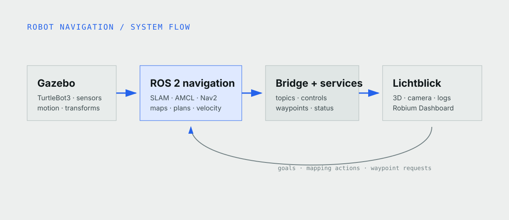

Most mobile robot projects need the same foundation. The robot has to map a
space, come back later and work out where it is, then drive to a goal without
clipping a wall. If that loop is unreliable, adding perception or an AI agent
just gives you a more complicated way to get stuck.

We built Robot Navigation to practice the whole loop in one place. Start a
TurtleBot3 Waffle Pi in Gazebo, drive it around while SLAM Toolbox builds the
map, and save the result. Then start a localization session, give AMCL an
initial pose, save a few useful places as waypoints, and ask Nav2 to drive to
one of them.

The last step looks almost too easy in the browser: click a goal and watch the
robot move. Underneath that click, the pose has to line up with the map, the
planner has to find a route, the controller has to produce velocity commands,
and the sensors have to keep the robot clear of the walls. Learning how those
pieces fit together is useful far beyond this demo. It is the same backbone you
will rely on when you add autonomy, perception, or a physical robot.


*A recorded Gazebo session viewed through Lichtblick. The robot, occupancy map,
active plan, camera, and control panel update from the same ROS 2 system.*

## One loop, two environments

The app includes a simulated house and an industrial warehouse. We use the
same workflow in both:

1. Start the simulation.
2. Drive while SLAM builds an occupancy map.
3. Save the map and load it for localization.
4. Give AMCL an initial pose.
5. Send a goal or save the current pose as a waypoint.
6. Watch Nav2 plan, control, and report status.

The browser workspace uses
[Lichtblick](https://github.com/Lichtblick-Suite/lichtblick) with a committed
layout and the reusable Robium Dashboard extension. The same ROS data is also
available to the official [Foxglove](https://docs.foxglove.dev/) application at
`ws://localhost:8765`.

Lichtblick is the default because it can ship with the application and does not
require an account. Foxglove remains useful for teams that want its broader
product and support.

## How the pieces connect



*Gazebo publishes the simulated sensors and motion. ROS 2 navigation processes
consume that data, then the bridge and application services expose it to the
browser.*

We keep the main ROS processes in one container and network namespace. This was
mainly a practical Docker Desktop decision: DDS discovery between containers
can be unreliable on macOS. The same image also works for local and hosted
runs.

Gazebo publishes lidar, odometry, IMU, camera, and transforms. During mapping,
`slam_toolbox` turns lidar and odometry into an occupancy map. During
localization, AMCL estimates the robot pose on a saved map. Nav2 plans a route
and publishes velocity commands. `foxglove_bridge` carries the topics and
services to the browser.

The Dashboard stays separate from the app-specific ROS interfaces. Another
project can reuse the extension with fewer controls, different service names,
or no simulator section.

## Start the stack

You need Git, Docker with Compose v2, a modern browser, and ports 8080 and 8765.
The simulation does not require a GPU, physical robot, or system ROS install.

```bash
npx robium-ai@latest setup
git clone https://github.com/robium-ai/robium-apps.git
cd robium-apps/robot-navigation
./app doctor
./app run
```

Open [http://localhost:8080](http://localhost:8080). The robot and Gazebo start
in the background, but the application begins in `IDLE`. Mapping and
localization start only when requested.

The first image build can take about ten minutes. Later runs reuse it unless
the source, dependencies, Dashboard, or simulation assets change. The
[application README](https://github.com/robium-ai/robium-apps/tree/main/robot-navigation)
covers remote access, remaining commands, and troubleshooting.

## Build a map that localization can use

Choose House or Warehouse, enter a map name, and select Start mapping. Drive
with WASD, arrow keys, or the on-screen controls. The lidar scan appears in the
3D view while `slam_toolbox` expands the occupancy map.


*The camera, scan, occupancy map, logs, and Dashboard stay visible during the
mapping run.*

Do not rush this part just because the map looks filled in. Observe walls from
more than one angle, and return near the starting area so SLAM can close the
loop. A fast pass often leaves gaps or slightly doubled walls that cause
trouble later during localization.

Finish mapping saves the files for the active environment and returns the app
to `IDLE`. Maps and waypoint sidecars remain local and untracked.

## Localize before tuning the planner

Load the saved map, then set the robot's initial pose and heading in the 3D
panel. Before sending a goal, check that the map is visible, the scan aligns
with nearby walls, and the robot model sits where expected.

If the scan is offset from the walls, fix the initial pose first. It is tempting
to start changing Nav2 parameters when the robot will not move, but planner
tuning cannot rescue a bad pose estimate.

> [!DECISION]
> The workspace keeps localization, plans, and logs visible together because a
> missing route and a bad pose can look like the same “robot does not move”
> failure from a control panel alone.

## Follow a route and save the destination

Use the 3D goal tool to select a reachable point and heading. Nav2 draws the
global plan in cyan. The local controller plan appears in orange and adjusts as
the robot moves.


*The saved map, localized robot pose, and active global route are visible
before the robot starts moving.*

A waypoint stores the robot's current map-frame position and heading. Drive or
navigate to a useful place, give it a name, and select Save position. Waypoints
are stored per map in `<map>.waypoints.json`, so locations from one environment
do not appear in another.


*Bedroom, dining table, and kitchen remain attached to the selected house map.*

Stop navigation cancels the active Nav2 goal. Stop robot also publishes zero
velocity. In this simulated application it is a useful control, not a hardware
emergency stop.

## Read the visible layers before the logs

When the robot refuses to move, start with what you can see instead of opening
every log at once:

- No map usually points to the session or map server.
- No global plan points to localization, the goal, or the planner.
- A global plan with no motion points farther down the command path.
- A changing local plan with repeated stops often points to sensors, costmaps,
  or collision monitoring.

Once you know which layer is missing, use the log panel to narrow it further.
It filters the shared `/rosout` stream into navigation, mapping, all ROS
messages, and application output. Remember that the plan display is supposed
to be empty until Nav2 receives a goal.

> [!EVIDENCE]
> The recorded sessions cover mapping, map reuse, initial-pose correction,
> waypoint storage, and multiple navigation goals in Gazebo. They do not cover
> a physical TurtleBot3.

## The Robium skills behind the build

[architect](https://github.com/robium-ai/robium/tree/main/skills/architect)
helped us cut the first version down to one complete navigation loop.
[simulation](https://github.com/robium-ai/robium/tree/main/skills/simulation)
and [gazebo](https://github.com/robium-ai/robium/tree/main/skills/gazebo) covered
the worlds and sensor setup.
[visualization](https://github.com/robium-ai/robium/tree/main/skills/visualization)
kept the map, pose, plans, transforms, camera, and logs on the same screen.

The single-container layout came from
[environments](https://github.com/robium-ai/robium/tree/main/skills/environments)
and [integration](https://github.com/robium-ai/robium/tree/main/skills/integration).
For the robot itself, we leaned on
[ros2](https://github.com/robium-ai/robium/tree/main/skills/ros2),
[navigation](https://github.com/robium-ai/robium/tree/main/skills/navigation),
and [foxglove](https://github.com/robium-ai/robium/tree/main/skills/foxglove)
for the topics, transforms, localization, Nav2 setup, and browser connection.

During debugging we kept coming back to one rule: follow the path in order.
Check the map, then the pose, the plan, the command, and finally the motion.
That caught problems with browser publishers, velocity message types, map
sessions, simulation assets, and waypoint storage without turning every issue
into a round of parameter tuning.

## Simulation is the boundary

Everything in this tutorial runs in simulation: one TurtleBot3 model and two
Gazebo environments. Moving it to a physical robot means doing the less tidy
work too: hardware interfaces, networking, safety controls, and calibration.
The bundled Lichtblick layout is the main browser experience. Foxglove can
inspect the same ROS data, but it does not load the configured Dashboard
workflow used here.

Source, smoke tests, architecture notes, and the reusable Dashboard live in the
[Robot Navigation repository](https://github.com/robium-ai/robium-apps/tree/main/robot-navigation).
If something does not work, ask in the [Robium Discord](https://robium.ai/join/discord)
or [create an issue](https://github.com/robium-ai/robium-apps/issues/new) with
your operating system, Docker version, and the command output.
