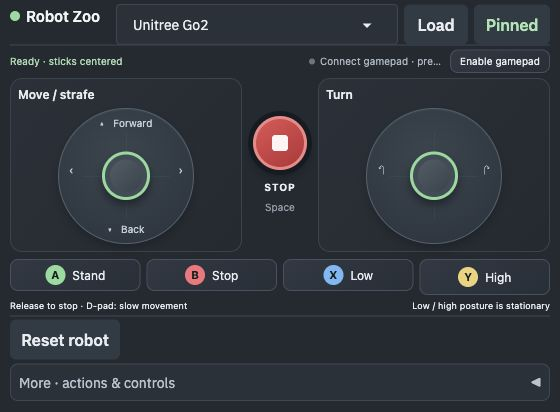

# Robot Zoo

Control a Franka Panda, TurtleBot3 Burger, or Unitree Go2 from a floating
native joystick controller window while MuJoCo's standard native viewer handles
simulation, rendering, camera interaction, and its full left/right diagnostic
panels.

This runs locally without ROS, Docker, a GPU, an account, or API keys. Go2
walking uses a pinned, checksum-verified pretrained policy on CPU (5.2 MB).



## Quick start

```bash
./app doctor
./app build
./app run
```

The first build installs the locked Python environment and downloads the two
pinned MuJoCo Menagerie model packages and the Go2 policy. TurtleBot3 is bundled. Later runs use the local uv and
Menagerie caches.

`./app run` opens two surfaces:

1. A wide floating controller with two large joysticks and a central Stop button.
2. MuJoCo's native viewer with a clear simulation viewport and mouse interaction.

The controller content is built with Gradio and hosted locally, but pywebview
embeds it in a native window. No browser or browser chrome is opened.

## Prerequisites

- macOS, or Ubuntu 24.04 x86_64 in an X11/XWayland desktop session
- [uv](https://docs.astral.sh/uv/getting-started/installation/)
- Network access for the first build, which downloads locked Python packages
  the Panda/Go2 models, and the Go2 walking policy

Ubuntu desktop installations normally provide the native libraries used by Qt
WebEngine. A minimal Ubuntu installation may need:

```bash
sudo apt install libnspr4 libnss3 libasound2t64 libcups2t64 libgbm1 \
  libxkbcommon-x11-0 libxcb-cursor0
```

X11 is verified directly; XWayland uses the same `DISPLAY` interface. Pure
Wayland without XWayland is not yet qualified. No GPU is required.

Check the host without installing anything:

```bash
./app doctor
```

The earlier Linux layout is captured in
[robot-zoo-linux.png](assets/stills/robot-zoo-linux.png). The new floating layout
and locomotion changes are verified on macOS; Linux requalification is pending.


## Controller

Drag the circular sticks; release to stop. The left stick moves, while the right
stick turns Go2 or TurtleBot3. Right-stick up/down is unassigned. Sticks support
mouse, simultaneous touch, keyboard, and standard-mapped gamepads.

| Gamepad / screen input | Go2 action | Keyboard |
| --- | --- | --- |
| Left stick up/down | Forward/backward | W / S |
| Left stick left/right | Strafe left/right | A / D |
| Right stick left/right | Turn left/right | Q / E |
| Right stick up/down | Unassigned | — |
| D-pad | Slow forward/backward/strafe | Arrow keys (normal speed) |
| A | Stand / walking-ready | — |
| B | Stop | Space |
| X / Y | Low / high profile | F / R |

Connect a gamepad by USB or an existing Bluetooth pairing, press a controller
button so the browser can discover it, then click **Enable gamepad**. Center
both sticks and release buttons to enable movement. Keep the controller window
focused. Physical gamepad hardware still needs a hands-on check; if the native
webview cannot map it, open the printed local controller URL in Chrome.

The speed multiplier is fixed at 1× in the controller; stick deflection controls
movement intensity, and the D-pad uses 35% deflection. Stop,
release, focus loss, disconnect, and a 500 ms input timeout zero movement.
**Reset robot** restores the initial pose. **Robot + Load** switches the model.

### Robot behavior

- **Franka Panda:** left stick moves the Cartesian end-effector target in XY.
  Actions raise/lower the target or open/close the gripper.
- **TurtleBot3 Burger:** left stick drives forward/backward; right stick turns.
  W/S drives and A/D or Q/E turns; the D-pad drives/turns slowly. No strafing
  or posture actions. B/Space/Stop stops; Reset restores the starting pose.
- **Unitree Go2:** a published MoE/CTS policy drives real contact-based walking,
  strafing and turning in MuJoCo. Low/high are stationary poses: selecting one
  stops motion, and moving again returns to the policy's walking height.
  Variable-height walking is not supported by this checkpoint.

See [Go2 controller sources and details](docs/go2-controller.md) for the upstream
API research, exact checkpoint, model settings, mappings, and validation.

## Native MuJoCo interaction

Both native panels start hidden to leave more room for the simulation.
With the MuJoCo window focused, `Tab` toggles the left configuration panel and
`Shift+Tab` toggles the right joint/control panel. Every standard section
remains available when needed.

The controller opens as a movable 560 × 440 window over the simulator, with
136-pixel sticks (larger when the window is widened) and the A/B/X/Y action row. **Pinned** keeps it above other
windows; click it to toggle **Pin on top**. Resize or move it using the native
window frame. Its geometry is saved in `~/.config/robot-zoo/window.json` and
restored within the current display bounds. MuJoCo uses the display independently.
**More · actions & controls** contains robot-specific actions and the control guide.

- Drag to rotate or pan the camera; scroll to zoom.
- Double-click a body, then Ctrl-drag to apply a perturbation.
- `F1` opens MuJoCo's built-in help.
- The native actuator panel remains available for inspection.

The simulation loop owns `mj_step()` and calls `viewer.sync()`. Robot switching
never replaces model/data underneath a live viewer: the manager closes the
current viewer, creates new `MjModel`/`MjData`, then opens a new passive viewer.

## Commands

| Command | Purpose |
| --- | --- |
| `./app build` | Resolve the uv environment and cache all robot models |
| `./app run` | Open the native controller and Panda in MuJoCo |
| `./app run --robot turtlebot3` | Start the controller and TurtleBot3 Burger |
| `./app run --robot go2` | Start the controller and Go2 |
| `./app viewer --robot panda` | Open only the full native MuJoCo viewer |
| `./app check` | Run bounded headless physics checks |
| `./app smoke` | Check the launcher, UI contract, controllers, and models |

## Model provenance

Panda and Go2 are downloaded through the pinned `mujoco-menagerie==2026.9.0`
package and remain under their upstream licenses:

- Franka Emika Panda — Apache-2.0
- Unitree Go2 — BSD-3-Clause

See [MuJoCo Menagerie](https://github.com/google-deepmind/mujoco_menagerie)
for those models' documentation, revisions, and licenses.

TurtleBot3 Burger comes from the manufacturer's
[ROBOTIS MuJoCo repository](https://github.com/ROBOTIS-GIT/robotis_mujoco_menagerie/tree/d8344c0dbe7a00208d0301111523dde65efc174a/robotis_tb3),
revision `d8344c0dbe7a00208d0301111523dde65efc174a`, Apache-2.0.
The original scene, robot XML, four required meshes, and license are bundled in
`src/robot_zoo/models/turtlebot3_burger/`; `SOURCE.json` records their SHA-256 hashes.
The model files are unmodified. No ROS or Gazebo conversion is involved.

The Burger controller uses the model's 0.033 m wheel radius, 0.160 m wheel
separation, and named wheel velocity actuators. Body commands convert to
wheel rates `(v - ωL/2)/r` and `(v + ωL/2)/r`. The app requests up to 0.22 m/s
and 1.5 rad/s; both rates scale together at the model's ±6.67 rad/s actuator
limits. These are commanded speeds: simulated contact and friction affect
measured travel. Physics tests check actual forward/reverse displacement,
left/right yaw, uprightness, stopping, and reset.

## Current boundary

The embedded controller server is local-only at `127.0.0.1`; sharing is
disabled. The native controller and MuJoCo run as two small processes because
both Cocoa/WebKit and MuJoCo require a main-thread UI loop. A local authenticated
command bridge keeps Gradio decoupled from `MjModel` and `MjData`:

```text
Native window (Gradio/WebKit)
            ↓
       command bridge
            ↓
    SimulationManager
            ↓
     robot controller
            ↓
   MuJoCo native viewer
```

The Go2 camera follows its base as it walks. Hardware control, obstacle courses,
and variable-height walking remain outside this local simulation example.
