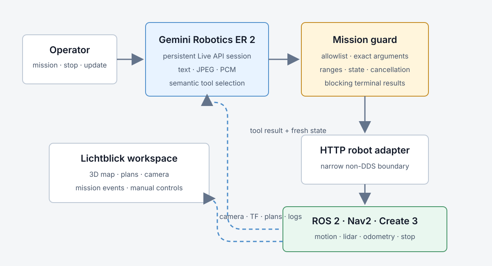

The original idea was a TurtleBot that could move through a room, notice what
was happening, and add a little personality to the result. The harder problem
was not the personality. It was building a continuous vision-and-language loop
without letting a generative model become the robot's motor controller.

Silly TurtleBot uses Gemini Robotics ER 2 Streaming to interpret an instruction,
camera frames, and robot state. It can select a small set of semantic actions.
ROS 2, Nav2, Create 3 actions, and an independent guard decide whether those
actions are valid and execute them. The same boundary runs against a fake
robot, a TurtleBot 4 in Gazebo, and the physical robot.

The occasional commentary is an application behavior on top of that stack. The
reusable part is the guarded observe-act-observe loop.

## Start with the model boundary, not the robot

We began with a fake adapter and one deterministic mission. It exposed the
shape of the model integration before any physical motion was possible:

1. Send an instruction and optional JPEG or raw PCM audio.
2. Receive model text or a function call.
3. Validate the call in ordinary Python.
4. Execute it through a fake robot.
5. Return the structured result with the original call ID.
6. Continue until the application reports task completion.

That slice caught the unfamiliar parts cheaply. Gemini's Live API does not
execute functions or return their results automatically. The client must keep
the receive loop alive, execute each requested function, and send a matching
`FunctionResponse` back into the session.

It also established the most important rule in the project: the model never
receives `/cmd_vel`, raw wheel commands, arbitrary poses, or unrestricted
coordinates.

> [!DECISION]
> Gemini chooses among capabilities. Deterministic software owns arguments,
> limits, cancellation, and the final actuator boundary.

## Why Gemini Robotics ER 2 Streaming

The application uses `gemini-robotics-er-2-streaming-preview`, not the standard
ER 2 request-response endpoint. The streaming endpoint accepts text, images,
video, and audio in one persistent Live API session and supports low-latency
function calling. Its output is text, so speech remains a separate bounded tool.

Physical actions are declared with blocking behavior. When the model asks the
robot to rotate, navigate, dock, or speak, the session waits for the real
terminal result before selecting another action. A request being accepted is
not reported as success.

The model-visible operations are semantic:

- inspect robot state;
- move a bounded signed distance at a bounded speed;
- rotate by a bounded angle;
- navigate to a configured location;
- look around and ground currently visible objects;
- face a person without approaching;
- speak a short message;
- stop, acknowledge progress, or complete the task.

The guard checks the exact argument set, finite numeric ranges, named locations,
current perception-issued object IDs, and the active-motion state. Prompt text
and JSON schemas help the model use the tools, but neither is treated as the
safety mechanism.

## Keep perception, planning, and motion separate



*Gemini owns multimodal interpretation and tool selection. The guard and robot
adapter turn those requests into bounded ROS 2 actions, while the browser reads
the same state through a separate visualization path.*

The operator-side agent is a locked Python environment. It owns the Gemini
session and talks to a narrow HTTP adapter instead of joining the robot's DDS
graph across the network.

On the physical TurtleBot, native ROS 2 Humble owns Nav2, lidar, odometry,
rolling costmaps, docking, and the action servers. An NVIDIA Orin runs the
DepthAI camera path and Kokoro neural speech in separate containers. The agent
can fail or reconnect without becoming the authority for low-level motion.

The simulator uses ROS 2 Jazzy and Gazebo Harmonic in one Docker container. It
reuses the furnished-home asset, occupancy map, and visualization lessons from
the Robot Navigation application while preserving TurtleBot 4's own Nav2
configuration. Keeping the ROS graph together also avoids making Docker Desktop
multicast discovery part of the application contract.

## Turn one request into a continuous mission

The first live implementation opened a Gemini connection for every submitted
instruction and returned one final HTTP response. The robot could be moving
correctly while the browser looked idle, and every request discarded the
session context.

The current control plane keeps one Gemini session open for the running robot.
Mission submission returns immediately. A background receive worker streams
model text and guarded tool events into a bounded server-sent-event journal,
while a single writer serializes instructions, images, and tool responses onto
the Live connection.

Camera frames continue during an active mission, but only the newest frame is
kept. A slow network or viewer should drop stale observations rather than build
a queue of old scenes. Images update context but do not start a reasoning turn,
so the application sends a compact heartbeat only when no model turn or
blocking tool is unresolved.

That distinction matters. A heartbeat is new model input, not a transport ping.
Sending one during a blocking action can interrupt the turn. Local progress
events can continue to the operator, while model-facing state waits for the
terminal function response.

After motion, the tool response includes a compact authoritative snapshot of
motion, docking, and odometry state. Visual actions also prioritize a fresh
post-action image. The next decision is based on the resulting scene rather
than the frame from before the robot moved.

## Build the simulation around observable contracts

The Gazebo slice was accepted only when one fresh container could prove the
whole boundary:

- the furnished world and TurtleBot 4 model loaded;
- localization and Nav2 became active;
- distance, rotation, and assisted-teleoperation actions existed;
- a fresh simulated OAK-D JPEG arrived;
- forward and quarter-turn actions completed through the semantic bridge;
- the bundled Lichtblick view showed the robot, scan, plans, camera, controls,
  and logs.

One failure looked like a generic headless-rendering problem. The installed
Create 3 model already owned a model-scoped Gazebo Sensors system configured
for Ogre 1. Adding another Sensors system at world scope did not override it;
it created two rendering owners and different failures. The reproducible fix
patched the existing xacro to Ogre2 and kept one Sensors system.

That lesson went back into the Gazebo skill: inspect who already owns rendering
before adding another plugin.

## Run the same boundary locally

You need Git, Docker with Compose v2, a modern browser, and a Gemini API key.
Load the key through your shell or secret manager, then run:

```bash
npx robium-ai@latest setup
git clone https://github.com/robium-ai/robium-apps.git
cd robium-apps/silly-turtlebot
./app doctor
./app run
```

Open [http://localhost:8091](http://localhost:8091). Enter a mission in the
Silly TurtleBot control panel and select Run mission. The default path is the
safe Gazebo simulation; it does not require a physical robot or local ROS
installation. The first run downloads and builds the pinned simulation inputs,
so later starts are faster.

For a hardware-free check without Gemini or Gazebo, run:

```bash
./app smoke
```

The smoke suite exercises the model-facing action guard, manual tool-response
loop, persistent session behavior, heartbeat filtering, camera flow, event
replay, cancellation, and the deterministic mock mission.

## Move to hardware without moving the safety boundary

The physical stack changes transports and drivers, not the model contract. The
TurtleBot Pi runs mapless, odom-relative Nav2 with rolling lidar costmaps. The
Orin serves full camera frames directly to Gemini and sends a reduced preview
through a robot-side ROS image relay for Lichtblick. Camera fetching runs in a
separate process so a stalled HTTP request cannot block navigation callbacks.

Speech follows the same isolation rule. The bounded `speak` tool calls a
Kokoro-82M service on the Orin, which owns inference and USB audio playback.
Navigation remains available if speech fails. A simpler Pi-side voice stays as
a fallback rather than becoming a hidden dependency of the mission loop.

The robot-side smoke checks actions, lidar, odometry, costmaps, lifecycle state,
camera freshness, and speech without commanding autonomous motion. Supervised
movement remains a separate acceptance step with the stop path ready.

> [!EVIDENCE]
> The fake mission, Gazebo navigation and camera path, physical ROS/Nav2 state,
> full-resolution OAK-D frame, low-bandwidth operator preview, and bounded
> neural speech have each passed. Repeated end-to-end autonomous physical
> missions remain a separate supervised validation step.

## The skills that shaped the app

`architect` kept the first slice on one visible outcome instead of a general
robot framework. `environments` separated the locked agent, simulation image,
native robot overlay, and Orin services. `simulation` and `gazebo` guided the
sensor and rendering contract. `ros2` and `navigation` kept TF, time, Nav2
actions, and command ownership explicit.

`integration` shaped the HTTP boundary between the cloud-facing agent and the
robot. `foxglove` supplied the Lichtblick topic and layout patterns. `testing`
kept fake, simulation, and hardware evidence distinct. The first application
also produced the `gemini-robotics` skill; the later STACK-CHAN ER 2 companion
added continuous microphone, tool-bound camera, half-duplex device, and optional
hardware lessons to the same guidance.

The important result is not that the robot can make a remark. It is that the
model can look, choose a bounded action, wait for real completion, and look
again without bypassing the software that owns the robot.

Source, launchers, tests, deployment scripts, and the complete architecture
brief live in the [Silly TurtleBot application](https://github.com/robium-ai/robium-apps/tree/main/silly-turtlebot).
