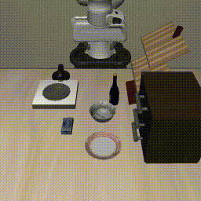
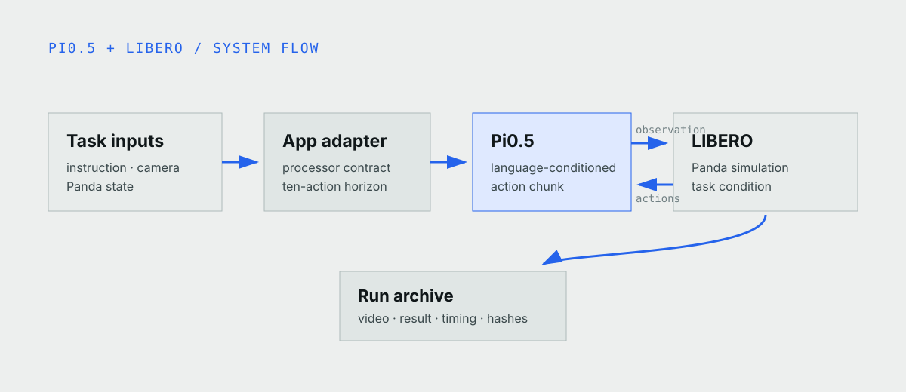
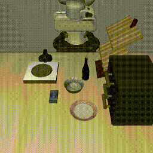

The instruction is short: “put the bowl on the plate.” Pi0.5 receives that
text, camera observations, and the Panda's current state. It chooses how to
approach the bowl, close the gripper, cross the scene, and release over the
plate.

There is no scripted grasp sequence behind the recorded run. LIBERO executes
the predicted actions and decides when its task condition is complete.



*A recorded Pi0.5 rollout in LIBERO-Goal task 8, starting from scene state 0.*

## Language has a real job here

ACT, Diffusion Policy, and Pi0.5 can all produce chunks of future robot
actions. The useful distinction is the information each model receives.

ACT fits coordinated imitation tasks with a fixed objective. Diffusion Policy
fits contact-rich behavior where several trajectories may be reasonable.
Pi0.5 also receives an instruction, so it makes sense when language changes the
object, action, or destination.

The bowl-and-plate scene has that boundary. The policy has to connect the nouns
in the instruction to visible objects and use the relation expressed by “on.”
Language is part of the task, not a label attached after the model choice.

> [!DECISION]
> We kept the application to one instruction and one LIBERO task. That made the
> model interface, action chunks, runtime cost, and recorded result inspectable
> before considering a broader VLA benchmark.

## From instruction to simulator action



*The adapter joins the instruction, camera frame, and Panda state for Pi0.5,
then returns a short action horizon to LIBERO and records the resulting run.*

At each model step, the application:

1. reads the current camera image and Panda state from LIBERO;
2. pairs them with the instruction;
3. converts the observation into the checkpoint's expected format;
4. requests an action chunk;
5. sends the next ten actions back to LIBERO; and
6. captures frames and simulator status.

The episode stops when LIBERO reports completion or the step limit is reached.
Keeping that decision in the simulator avoids a second hand-written success
detector in the browser application.



*A separate recorded attempt starts from state 1 and reaches the same task
condition through a different trajectory.*

## The checkpoint keeps its native stack

This Pi0.5 checkpoint is tied to LeRobot 0.4.4 and its processor contract.
Moving it into the newer runtime used by the ACT and PushT apps would introduce
an untested model conversion, so this application pins the older stack.

The checkpoint, tokenizer, LeRobot source, and LIBERO source use exact
revisions. The CUDA image runs Python 3.10 and MuJoCo EGL so the simulator can
render without a desktop display.

Model files live on a RunPod network volume. Startup checks them, copies them to
transient local disk, then loads with network access disabled. The image also
supplies LIBERO's expected configuration and asset paths so a headless Pod does
not wait for an installation prompt.

## Compilation helps the long run, not the first click

TorchInductor can compile Pi0.5 operations for a specific GPU. In the recorded
set, the first episode took about 239 seconds and its slowest action call took
about 231 seconds. The next episode finished in about 6.7 seconds, with a
slowest action call of 118 ms.

That tradeoff makes sense for a multi-episode evaluation because compilation is
paid once. It is poor feedback for a short interactive session: the simulator
looks ready while the first action compiles.

The interactive runtime therefore supports eager execution. It gives up some
repeated throughput to start useful work sooner. This changes execution, not
the checkpoint weights or language interface.

## Work locally without pretending the fixture is Pi0.5

macOS cannot run this CUDA checkpoint, but most interface and lifecycle work
does not need it. The local path uses three compact LIBERO frames and a
deterministic fake policy behind the same prompt, state selection, locking,
cancellation, gateway, and Gradio interfaces.

```bash
npx robium-ai@latest setup
git clone https://github.com/robium-ai/robium-apps.git
cd robium-apps/vla-pick-and-place
./app doctor
./app run
```

The local workspace is useful for UI and gateway development. It is labeled as
a fixture and is not used to describe Pi0.5 behavior. The
[application README](https://github.com/robium-ai/robium-apps/tree/main/vla-pick-and-place)
covers the paid preflight, evaluation path, and remaining commands.

## What happened in the recorded set

The published archive contains 20 attempts from different starting states and
seeds. Each began with fresh simulator and policy state. All 20 reached
LIBERO's bowl-on-plate task condition on an NVIDIA RTX PRO 4500 Blackwell
Server Edition.

That set describes the pinned application path for LIBERO-Goal task 8. It does
not describe other LIBERO tasks, edited instructions, another robot, or a
physical Panda. Exact revisions, configuration, container digest, timings,
hashes, and individual videos remain in the immutable run archive.

> [!EVIDENCE]
> The result is 20 completed attempts in this recorded set. It is not a general
> success rate for Pi0.5 across LIBERO or physical manipulation.

The [complete run archive](https://huggingface.co/datasets/robium/pi05-libero-goal-task-8-evidence/tree/d9908eb717d3e8d62ca7ba0820a825daf36fa7c0)
contains the individual videos and result records.

## Keep each browser session isolated

The hosted path creates a temporary RunPod Pod for one visitor. A lifecycle
controller starts and deletes the Pod, while a capability-scoped URL connects
the browser after readiness.

The application permits one active robot run per instance. A second request
gets a readable busy state instead of mutating the same simulator. Stop sets a
cooperative cancellation signal and releases the lock after the current
simulator step. Startup diagnostics remain on the attached volume if the
container exits before browser logs explain the failure.

Current public availability and runtime mode remain website-owned operational
choices. The article describes the application contract, not a promise that
paid GPU capacity is enabled for every visit.

## Cheap iteration, expensive run

The `architect` skill narrowed the project to one language-conditioned task.
`lerobot` kept the checkpoint and processor boundary explicit. `environments`
separated free local interface work from the CUDA runtime. `runpod`,
`live-demo`, and `testing` shaped the paid preflight, capability isolation,
cancellation, diagnostics, and Pod deletion checks.

The main design improvement was the fixture boundary. It lets the public UI and
lifecycle evolve without spending GPU time, while the article can still say
exactly which frames came from Pi0.5.

## What remains narrow or expensive

The application runs an existing Pi0.5 checkpoint on one simulated LIBERO task.
It does not train or fine-tune the model, cover physical Panda control, or test
instruction variation. Compilation adds a large first-action delay, and the
real policy path requires a supported NVIDIA GPU with enough memory.

Source, schemas, publication pointer, and architecture notes live in the
[Pi0.5 application](https://github.com/robium-ai/robium-apps/tree/main/vla-pick-and-place).
