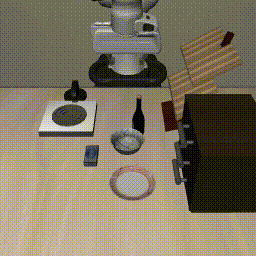

# Public Pi0.5 evaluation result

The pinned official Pi0.5 LIBERO checkpoint passed this app's fixed benchmark
with **20 successes in 20 episodes**, exceeding the issue #69 acceptance target
of 16/20. This result applies only to zero-based LIBERO-Goal task 8,
`put_the_bowl_on_the_plate`, with the canonical prompt “put the bowl on the
plate.” It is not a broader claim about other tasks, edited prompts, or physical
robots.

## Immutable evidence

- Public evidence dataset: [revision `d9908eb717d3e8d62ca7ba0820a825daf36fa7c0`](https://huggingface.co/datasets/robium/pi05-libero-goal-task-8-evidence/tree/d9908eb717d3e8d62ca7ba0820a825daf36fa7c0)
- Manifest SHA-256: `d7e7096d2eb7426cf61a849668d8588fc298177150294c347908d78d2ff645ca`
- Application commit evaluated: `9aba9cba20ea18e5b98f95ccce65f242bc2a8eff`
- Container image: `us-central1-docker.pkg.dev/robium-prod/robium/vla-pick-and-place@sha256:1301937ab020a8120b54aefd680f40ed4191857406e9cb1e73816bfaf1270f0c`
- Cloud Build: [`f60e2505-72b0-4bb2-b881-f8976c923efa`](https://console.cloud.google.com/cloud-build/builds/f60e2505-72b0-4bb2-b881-f8976c923efa?project=902570464351)

The public dataset contains all 20 H.264 MP4 rollouts, all 20 per-episode JSON
records, the manifest, CUDA preflight, phase marker, README, and checksums. An
anonymous exact-revision download reproduced the manifest hash and passed every
entry in `SHA256SUMS`; all 20 videos passed `ffprobe` and matched their manifest
hashes.

## Measured run

| Field | Result |
| --- | --- |
| RunPod Pod | `j49jvedkgd9gmi` (deleted after evidence retrieval) |
| Region / GPU | Secure Cloud `US-KS-2` / NVIDIA RTX PRO 4500 Blackwell Server Edition |
| Protocol | 20 sequential episodes; states 0–19; seeds 1000–1019; no retries |
| Success | 20/20 |
| First episode | 239.239 s, including a 231.214 s first compiled action |
| Warm episodes | 6.357 s mean; 6.747 s maximum across the remaining 19 |
| Episode steps | 70–80; 75.2 mean |
| Measured RunPod cost | $0.2252055332 |

The first rollout pays the TorchInductor compilation cost; subsequent episodes
reuse the compiled graph. The interactive gateway therefore uses its separately
validated eager profile so a visitor does not wait through this compilation.

## Repository previews

The following compact previews were generated directly from the immutable public
MP4s; the public dataset remains the source of truth.

| State 0 | State 1 | State 2 |
| --- | --- | --- |
|  |  |  |

Production live sessions remain disabled. This evaluation proves the fixed
benchmark and immutable runtime; it does not authorize enabling live traffic.
